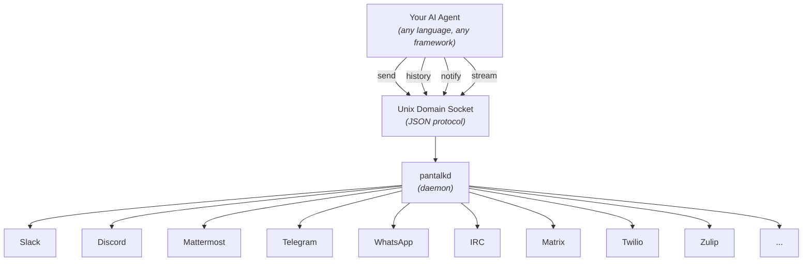

<p align="center">
  
</p>

<h1 align="center">Pantalk</h1>

<p align="center">
  <strong>Give your AI agent a voice on every chat platform.</strong><br/>
  A lightweight daemon that lets AI agents send, receive, and stream messages across Slack, Discord, Mattermost, Telegram, WhatsApp, IRC, Matrix, Twilio, and Zulip through a single interface.
</p>

<p align="center">
  <a href="https://pantalk.dev">Website</a> · <a href="https://pantalk.dev/about">About</a> · <a href="#quick-start">Quick Start</a> · <a href="#platform-setup">Platform Setup</a>
</p>

---

## The Problem

AI agents need to communicate with humans where they already are - Slack, Discord, Mattermost, Telegram, WhatsApp, IRC, Matrix, Twilio, Zulip. But every platform speaks a different protocol. Building an agent that can participate in conversations across all of them means writing and maintaining separate integrations before your agent can even say "hello."

## The Solution

Pantalk gives your AI agent a single, consistent interface to all chat platforms. One daemon (`pantalkd`) handles the upstream complexity - auth, sessions, reconnects, rate limits - while your agent talks through simple CLI commands or a Unix domain socket with a JSON protocol.



## Why Pantalk

|                        | Without Pantalk            | With Pantalk                  |
| ---------------------- | -------------------------- | ----------------------------- |
| **Integration effort** | One SDK per platform       | One CLI, all platforms        |
| **Auth & sessions**    | You manage everything      | Daemon handles it             |
| **Message history**    | Query each API differently | `history --limit 20`          |
| **Notifications**      | Build your own routing     | `notifications --unseen`      |
| **Real-time events**   | WebSocket/Gateway/polling  | `stream --bot name`           |
| **Composability**      | Library lock-in            | Pipe to `grep`, `jq`, `xargs` |

## Supported Platforms

| Platform       | Transport                       | Status          |
| -------------- | ------------------------------- | --------------- |
| **Slack**      | Socket Mode + Web API           | ✅ Full support |
| **Discord**    | Gateway + REST API              | ✅ Full support |
| **Mattermost** | WebSocket + REST API            | ✅ Full support |
| **Telegram**   | Bot API long-poll + sendMessage | ✅ Full support |
| **WhatsApp**   | Web multi-device (whatsmeow)    | ✅ Full support |
| **IRC**        | TCP/TLS + IRC protocol          | ✅ Full support |
| **Matrix**     | Client-Server API (mautrix-go)  | ✅ Full support |
| **Twilio**     | REST API (polling + send)       | ✅ Full support |
| **Zulip**      | REST API + Event Queue          | ✅ Full support |

## Star History

[](https://www.star-history.com/#pantalk/pantalk&type=date&legend=top-left)

---

## Architecture

| Component  | Role                                                                                  |
| ---------- | ------------------------------------------------------------------------------------- |
| `pantalkd` | Local daemon - maintains persistent upstream sessions (WebSocket, Gateway, long-poll) |
| `pantalk`  | Unified CLI - messaging, admin, and config management                                 |

All clients connect to `pantalkd` through a **Unix domain socket** using a simple JSON protocol. AI agents and LLM tools can send, receive, and stream chat messages without embedding any service SDK.

### Design Principles

- **Agent-first** - structured output, skill definitions, and notification routing designed for AI agents
- **One daemon, all platforms** - upstream auth/session complexity lives in `pantalkd`
- **Composable CLI** - JSON over Unix socket, works with `grep`, `jq`, `xargs`, and any language
- **Multi-bot** - define multiple bots per service via config
- **Local-first** - SQLite persistence, no external dependencies

## Source Layout

```
cmd/
  pantalkd/              # Daemon entry point
  pantalk/               # Unified CLI (messaging + admin)
configs/
  pantalk.example.yaml   # Example configuration
docs/
  agents.md              # Reactive agent configuration guide
  slack-setup.md         # Slack platform setup guide
  discord-setup.md       # Discord platform setup guide
  mattermost-setup.md    # Mattermost platform setup guide
  telegram-setup.md      # Telegram platform setup guide
  whatsapp-setup.md      # WhatsApp platform setup guide
  irc-setup.md           # IRC platform setup guide
  matrix-setup.md        # Matrix platform setup guide
  twilio-setup.md        # Twilio platform setup guide
  zulip-setup.md         # Zulip platform setup guide
  claude-code-hooks.md   # Claude Code hooks integration guide
internal/
  client/                # Shared IPC client logic
  config/                # YAML parsing & validation
  protocol/              # JSON protocol types
  server/                # Daemon server + SQLite
  upstream/              # Platform connectors
```

## Quick Start

### 1. Configure

Create a config file with your bot credentials:

```bash
mkdir -p ~/.config/pantalk
cat > ~/.config/pantalk/config.yaml << 'EOF'
server:
  notification_history_size: 1000

bots:
  - name: my-bot
    type: slack
    bot_token: $SLACK_BOT_TOKEN
    app_level_token: $SLACK_APP_LEVEL_TOKEN
    channels:
      - C0123456789
EOF
```

See `configs/pantalk.example.yaml` for a full example with all platforms.

### 2. Start the daemon

```bash
# Uses ~/.config/pantalk/config.yaml by default
pantalkd &

# Or specify a custom config
pantalkd --config /path/to/pantalk.yaml

# Override socket/db paths
pantalkd --socket /tmp/pantalk-dev.sock --db /tmp/pantalk-dev.db
```

### Path Defaults

| Resource | Default Location                    | Override                      |
| -------- | ----------------------------------- | ----------------------------- |
| Config   | `~/.config/pantalk/config.yaml`     | `--config`, `$PANTALK_CONFIG` |
| Socket   | `$XDG_RUNTIME_DIR/pantalk.sock`     | `--socket` flag               |
| Database | `~/.local/share/pantalk/pantalk.db` | `--db` flag                   |

All paths follow the [XDG Base Directory Specification](https://specifications.freedesktop.org/basedir-spec/latest/).

### 3. Use the CLI

The unified `pantalk` binary works with all platforms. The daemon resolves which service each bot belongs to automatically.

```bash
# List all bots across all services
pantalk bots

# Send a message (service is auto-resolved from bot name)
pantalk send --bot my-bot --channel C0123456789 --text "hello from cli"
pantalk send --bot my-bot --channel C0123456789 --thread 1711234567.000100 --text "reply in thread"

# Read history
pantalk history --bot my-bot --channel C0123456789 --limit 20

# Check & clear notifications
pantalk notifications --bot my-bot --unseen --limit 50
pantalk notifications --bot my-bot --unseen --clear

# Stream events in real-time (auto-disconnects after 60s by default)
pantalk stream --bot my-bot --notify

# Stream with custom timeout (0 = no timeout)
pantalk stream --bot my-bot --notify --timeout 120
```

> **Tip:** JSON output is automatic when stdout is not a terminal (e.g. when called by an AI agent). Use `--json` to force it in interactive mode.

### 4. Manage config on the fly

```bash
# Validate config (uses default config location)
pantalk validate

# Edit non-interactively
pantalk config set-server --history 1000

pantalk config add-bot \
  --type slack --name my-bot \
  --bot-token '$SLACK_BOT_TOKEN' --app-level-token '$SLACK_APP_LEVEL_TOKEN'

# Hot-reload running daemon
pantalk reload
```

---

## Configuration

`pantalkd` initializes entirely from YAML config with strict schema validation:

- ❌ Unknown keys → config load failure
- ❌ Missing required provider fields → fast failure
- ✅ `transport` and `endpoint` optional for built-in providers (Slack, Discord, Telegram)
- ⚠️ Mattermost requires `endpoint` on the bot entry

### Multi-bot support

```yaml
bots:
  - name: ops-bot # --bot ops-bot
    type: slack
  - name: eng-bot # --bot eng-bot
    type: slack
```

### Daemon flags

| Flag           | Description                                        |
| -------------- | -------------------------------------------------- |
| `--config`     | Path to YAML config file                           |
| `--socket`     | Override `server.socket_path`                      |
| `--db`         | Override `server.db_path`                          |
| `--allow-exec` | Allow agent commands outside the default allowlist |
| `--debug`      | Enable verbose debug logging                       |
| `--version`    | Print version and exit                             |

### Hot reload

```bash
pantalk reload
```

- Reloads config from the daemon's `--config` path
- Restarts service connectors in-process
- Supports bot/service changes
- Does **not** switch `socket_path` or `db_path` at runtime (restart `pantalkd` for those)

---

## Implementation Notes

### IPC Protocol

JSON over Unix domain socket. Every request is a single JSON object with an `action` field:

```json
{"action": "bots"}
{"action": "send", "bot": "my-bot", "channel": "C0123", "text": "hello"}
{"action": "history", "bot": "my-bot", "channel": "C0123", "limit": 20}
{"action": "history", "bot": "my-bot", "search": "deploy", "limit": 50}
{"action": "notifications", "bot": "my-bot", "unseen": true}
{"action": "subscribe", "bot": "my-bot", "notify": true}
```

### Platform Connectors

| Platform   | Event Streaming   | Message Send  |
| ---------- | ----------------- | ------------- |
| Slack      | Socket Mode       | Web API       |
| Discord    | Gateway           | REST API      |
| Mattermost | WebSocket         | REST API      |
| Telegram   | Bot API long-poll | `sendMessage` |
| WhatsApp   | Web multi-device  | `SendMessage` |
| IRC        | TCP/TLS           | `PRIVMSG`     |
| Matrix     | Client-Server API | REST API      |
| Twilio     | REST API poll     | REST API      |
| Zulip      | Event Queue       | REST API      |

### Persistence

All events are persisted locally in **SQLite**. `history` always reads from local state.

### Server Capabilities

| Action                | Description                                       |
| --------------------- | ------------------------------------------------- |
| `ping`                | Health check                                      |
| `bots`                | Bot discovery across all services                 |
| `send`                | Route-aware send with `target`/`channel`/`thread` |
| `history`             | Filtered message/event history                    |
| `notifications`       | Agent-relevant inbound events                     |
| `clear_history`       | Delete matching history events                    |
| `clear_notifications` | Delete matching notifications                     |
| `subscribe`           | Filtered real-time streaming                      |
| `reload`              | Hot-reload config and restart connectors          |

---

## Agent Notifications

Pantalk surfaces events relevant to the agent via `notifications`. This is designed for AI agents that need to know when they're being talked to.

### Notification behavior

| Behavior                  | Detail                                           |
| ------------------------- | ------------------------------------------------ |
| **Listing doesn't clear** | Reading notifications is non-destructive         |
| **Persistent**            | Stored in SQLite, survives daemon restarts       |
| **Explicit clearing**     | Use `notifications --clear` or `history --clear` |

### Clearing scopes

```bash
notifications --bot my-bot --clear                       # All for a bot
notifications --bot my-bot --channel C0 --clear          # Scoped by channel
notifications --clear --all                              # Everything
history --bot my-bot --clear                             # Clear history for a bot
history --clear --all                                    # Clear all history
```

### What triggers a notification

An inbound event becomes a notification when any of these are true:

- **Direct message** - `target` matches `dm:*`, `direct:*`, `user:*`, or DM-like channel IDs
- **Mention** - message contains `@bot-name` or `<@platform-user-id>` (auto-discovered at runtime)
- **Active thread** - event is on a route where the agent previously sent a message

---

## Platform Setup

Each platform requires its own app/bot setup before Pantalk can connect. See the detailed guides:

| Platform   | Guide                                        | Connection Method       |
| ---------- | -------------------------------------------- | ----------------------- |
| Slack      | [Slack Setup](docs/slack-setup.md)           | Socket Mode (WebSocket) |
| Discord    | [Discord Setup](docs/discord-setup.md)       | Gateway (WebSocket)     |
| Mattermost | [Mattermost Setup](docs/mattermost-setup.md) | WebSocket + REST API    |
| Telegram   | [Telegram Setup](docs/telegram-setup.md)     | Bot API (long-poll)     |
| WhatsApp   | [WhatsApp Setup](docs/whatsapp-setup.md)     | Web multi-device        |
| IRC        | [IRC Setup](docs/irc-setup.md)               | TCP/TLS                 |
| Matrix     | [Matrix Setup](docs/matrix-setup.md)         | Client-Server API       |
| Twilio     | [Twilio Setup](docs/twilio-setup.md)         | REST API (polling)      |
| Zulip      | [Zulip Setup](docs/zulip-setup.md)           | REST API + Event Queue  |

---

## Integrations

| Integration | Guide                                          | Description                                                                                           |
| ----------- | ---------------------------------------------- | ----------------------------------------------------------------------------------------------------- |
| Agents      | [Agents](docs/agents.md)                       | Launch AI agents automatically when matching notifications arrive                                     |
| Claude Code | [Claude Code Hooks](docs/claude-code-hooks.md) | Use pantalk as a hook to forward notifications, check chat on stop, and load context on session start |

---

## Roadmap

- Richer provider event support (edits, reactions, thread metadata)
- Provider-specific message normalization
- Additional platform connectors

---

<p align="center">
  <a href="https://pantalk.dev">pantalk.dev</a></sub>
</p>
