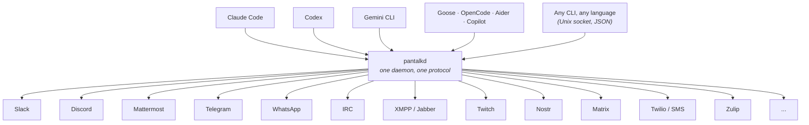

<p align="center">
  
</p>

<h1 align="center">Pantalk</h1>

<p align="center">
  <strong>Any agent, any chat.</strong><br/>
  A daemon that puts the coding agent you already run - Claude Code, Codex, Kimi Code, Zot, Copilot, Gemini CLI, Goose, OpenCode, Aider - into the chat apps your team already uses: Slack, Discord, Mattermost, Telegram, WhatsApp, IRC, XMPP/Jabber, Twitch, Nostr, Matrix, SMS, Zulip, and iMessage. Nothing is welded together, so you pick both ends and can change either one later.
</p>

<p align="center">
  <a href="https://pantalk.dev">Website</a> · <a href="#what-you-get-out-of-it">Use Cases</a> · <a href="#quick-start">Quick Start</a> · <a href="#pantalk-ghost">Ghost</a> · <a href="#docker">Docker</a> · <a href="#platform-setup">Platform Setup</a>
</p>

---

## The Problem

Putting an agent into chat is a solved problem - once, for one pair. Anthropic's
Claude tag puts Claude in Slack. OpenAI's Codex app puts Codex in Slack. Block's
[Buzz](https://github.com/block/buzz) puts Block's agents in Block's workspace.
All of them are good products, and all of them decide the pair for you: one
harness, welded to one platform.

That is the wrong shape. Harnesses turn over fast - the one you standardized on
last quarter is not the one you want in this repo today. Platforms don't turn
over at all - your colleagues are in Slack, your customers are on WhatsApp,
your on-call gets SMS, and the community you support has never left IRC. Wiring
a specific harness to a specific platform means rewriting the integration every
time either end moves.

## The Solution

Pantalk keeps the two ends separate and makes both of them pluggable.

Harnesses plug in on one edge. Platforms plug in on the other. `pantalkd` sits
in the middle and is the only thing that knows about either, so the matrix is
YAML rather than integration code:


```mermaid
graph TD
    Claude["Claude Code"] --> Daemon
    Codex["Codex"] --> Daemon
    Gemini["Gemini CLI"] --> Daemon
    Goose["Goose · OpenCode · Aider · Copilot"] --> Daemon
    Any["Any CLI, any language<br/><em>(Unix socket, JSON)</em>"] --> Daemon
    Daemon["pantalkd<br/><em>one daemon, one protocol</em>"]
    Daemon --> Slack
    Daemon --> Discord
    Daemon --> Mattermost
    Daemon --> Telegram
    Daemon --> WhatsApp
    Daemon --> IRC
    Daemon --> XMPP["XMPP / Jabber"]
    Daemon --> Twitch
    Daemon --> Nostr
    Daemon --> Matrix
    Daemon --> Twilio["Twilio / SMS"]
    Daemon --> Zulip
    Daemon --> More["..."]
```

The result is what a Claude tag or a Buzz gives you - an agent that is a real
participant in the conversation, mentionable, threaded, with history - except
you choose both ends. Point Claude Code at Slack, Codex at Telegram, and Gemini
CLI at IRC from the same config, and change any one of those by editing a
`driver:` line.

## What You Get Out Of It

Pluggability is the mechanism. These are the reasons to care.

### 1. Ship code from a chat thread

Claude Code and Codex already open PRs, fix failing tests, and review diffs.
They just do it in a terminal only one person can see. Bind one to a channel and
the work happens where it was asked for - someone requests a fix in
`#engineering`, the PR link comes back in the same thread, and the whole team
watched it happen.

```yaml
agents:
  - name: engineering
    driver: claude
    workdir: /workspace/project

bots:
  - name: company-slack
    type: slack
    bot_token: $SLACK_BOT_TOKEN
    app_level_token: $SLACK_APP_LEVEL_TOKEN
    agents:
      - agent: engineering
        when: true
```

The harness keeps your repo, your sandbox settings, and your approval policy.
Pantalk only decides which conversations reach it.

### 2. Agents that act on incidents

Point an agent at the channel your on-call already watches. It triages, works
the runbook, and reports back - and because Twilio and WhatsApp are just other
connectors, it can reach a phone that has nothing installed on it.

```yaml
agents:
  - name: engineering
    driver: claude
    workdir: /workspace/project

bots:
  - name: ops-slack
    type: slack
    bot_token: $SLACK_BOT_TOKEN
    app_level_token: $SLACK_APP_LEVEL_TOKEN
    agents:
      - agent: engineering
        when: 'channel == "#incidents"'

  - name: oncall-sms
    type: twilio
    account_sid: $TWILIO_ACCOUNT_SID
    auth_token: $TWILIO_AUTH_TOKEN
    phone_number: $TWILIO_PHONE_NUMBER
    agents:
      - agent: engineering
        when: direct

      - name: morning-brief
        agent: engineering
        when: 'at("08:00") && weekday in ["mon","tue","wed","thu","fri"]'
        timezone: Europe/London
        target: $ONCALL_PHONE_NUMBER # SMS has no channel; a schedule needs a destination
        prompt: |
          Summarize overnight alerts and open incidents.
```

Ordered `when:` bindings decide what escalates and what gets handled quietly.
Scheduled prompts let the same agent post a summary before anyone opens a
laptop. See [`docs/agents.md`](docs/agents.md).

### 3. One subscription, whole team

This one is worth stating plainly: **you do not need a seat per person.**

`pantalkd` runs one authenticated Claude Code or Codex install. Everyone else
reaches it by DM or mention from the chat client they already have open. No
per-person license, no local install, no terminal.

```yaml
agents:
  - name: engineering
    driver: claude
    workdir: /workspace/project

bots:
  - name: team-assistant
    type: slack
    bot_token: $SLACK_BOT_TOKEN
    app_level_token: $SLACK_APP_LEVEL_TOKEN
    agents:
      - agent: engineering
        when: direct # every teammate's DM, one shared harness
```

Sessions are keyed by service, bot, channel, thread, **and user**, so each
teammate gets an isolated conversation - nobody inherits anyone else's context.
Designers, PMs, and support get the same assistant as the engineers, without
ever touching a CLI.

---

## Complete Pluggability

|                   | Harness-specific product       | Pantalk                                                 |
| ----------------- | ------------------------------ | ------------------------------------------------------- |
| **The pair**      | Chosen for you                 | You choose both ends, independently                     |
| **Swap harness**  | Migrate to another product     | Change `driver:` in YAML                                |
| **Swap platform** | Wait for the vendor to ship it | Change `type:` in YAML                                  |
| **Many at once**  | One agent, one platform        | N harnesses × M platforms, one daemon                   |
| **Adoption cost** | Your team moves or installs    | Nothing changes for anyone                              |
| **Reach**         | The supported platform         | Thirteen platforms, including phone numbers with no app |

And beneath that, the plumbing every one of those pairings would otherwise make
you rebuild:

|                        | Without Pantalk            | With Pantalk                  |
| ---------------------- | -------------------------- | ----------------------------- |
| **Integration effort** | One SDK per platform       | One CLI, all platforms        |
| **Auth & sessions**    | You manage everything      | Daemon handles it             |
| **Message history**    | Query each API differently | `history --limit 20`          |
| **Notifications**      | Build your own routing     | `notifications --unseen`      |
| **Real-time events**   | WebSocket/Gateway/polling  | `stream --bot name`           |
| **Composability**      | Library lock-in            | Pipe to `grep`, `jq`, `xargs` |

## Supported Harnesses

Native and ACP drivers own a persistent session and derive a durable thread per
conversation. The `command` driver runs other harnesses fire-and-forget.

| Harness           | Driver                              | Notes                                          |
| ----------------- | ----------------------------------- | ---------------------------------------------- |
| **Claude Code**   | `claude` native                     | Reuses local auth/config, resumes sessions     |
| **Codex**         | `codex` native                      | Persistent `app-server`, durable Codex threads |
| **Kimi Code**     | `acp`, command `kimi acp`           | Persistent ACP sessions and model selection    |
| **zot**           | `acp`, command `zot acp`            | Autonomous coding agent over ACP               |
| **Copilot**       | `command`                           | Allowlisted by default                         |
| **Gemini CLI**    | `command`                           | Allowlisted by default                         |
| **Goose**         | `command`                           | Allowlisted by default                         |
| **OpenCode**      | `command`                           | Allowlisted by default                         |
| **Aider**         | `command`                           | Allowlisted by default                         |
| **Anything else** | `acp` or `command` + `--allow-exec` | Or drive the socket directly from any language |

Every harness in that table reaches every platform in the next one. See
[`docs/agents.md`](docs/agents.md) for the full driver reference, and
[Pantalk Ghost](#pantalk-ghost) for a working example you can boot in one
command.

## Supported Platforms

| Platform        | Transport                       | Status                |
| --------------- | ------------------------------- | --------------------- |
| **Local**       | Unix socket                     | ✅ Dev/test           |
| **Slack**       | Socket Mode + Web API           | ✅ Full support       |
| **Discord**     | Gateway + REST API              | ✅ Full support       |
| **Mattermost**  | WebSocket + REST API            | ✅ Full support       |
| **Telegram**    | Bot API long-poll + sendMessage | ✅ Full support       |
| **WhatsApp**    | Web multi-device (whatsmeow)    | ✅ Full support       |
| **IRC**         | TCP/TLS + IRC protocol          | ✅ Full support       |
| **XMPP/Jabber** | Client-to-server + MUC          | ✅ DM/MUC + typing    |
| **Twitch**      | IRC over TLS + IRCv3            | ✅ Chat support       |
| **Nostr**       | Relay WebSocket (NIP-17/28/29)  | ✅ DM/channel support |
| **Matrix**      | Client-Server API (mautrix-go)  | ✅ Full support       |
| **Twilio**      | REST API (polling + send)       | ✅ Full support       |
| **Zulip**       | REST API + Event Queue          | ✅ Full support       |
| **iMessage**    | Messages database + AppleScript | ✅ macOS support      |

---

## Architecture

| Component  | Role                                                                                  |
| ---------- | ------------------------------------------------------------------------------------- |
| `pantalkd` | Local daemon - maintains persistent upstream sessions (WebSocket, Gateway, long-poll) |
| `pantalk`  | Unified CLI plus an embedded one-command local testing mode                           |

Normal client commands connect to `pantalkd` through a **Unix domain socket**
using a simple JSON protocol. `pantalk local` embeds the same server and still
uses that socket protocol internally. Any agentic harness can send, receive, and
stream chat messages without embedding a provider SDK - and without the platform
knowing which harness is on the other end.

### Design Principles

- **Both ends pluggable** - harnesses attach through drivers, platforms through connectors; neither knows about the other
- **Agent-first** - structured output, skill definitions, and notification routing designed for agentic harnesses
- **One daemon, all platforms** - upstream auth/session complexity lives in `pantalkd`
- **Composable CLI** - JSON over Unix socket, works with `grep`, `jq`, `xargs`, and any language
- **Multi-bot** - define multiple bots per service via config
- **Local-first** - SQLite persistence, no external dependencies

## Pantalk Ghost

[Pantalk Ghost](https://github.com/pantalk/ghost) is the reference showcase:
a browser-accessible Linux desktop with Pantalk, Codex, Claude Code, and Kimi
Code installed. Codex and Claude Code are registered in the starter config;
Kimi Code is ready to add through the ACP driver. It exists to make the
pluggability concrete - boot it, log into a harness, pick a deployment, and an
agent is live in a real chat server minutes later.

```bash
docker run --detach \
  --name pantalk-ghost \
  --shm-size 1g \
  --publish 127.0.0.1:6902:6901 \
  ghcr.io/pantalk/ghost:latest
```

Open <http://127.0.0.1:6902>. Ghost ships transport-neutral on purpose: the
messaging system is a deployment recipe, not part of the image. Bring up
Mattermost or an Ergo IRC server alongside it with one command, and swap which
harness answers by editing one line of Pantalk config.

## Docker

Official Linux amd64 and arm64 images are published to GitHub Container
Registry from the same version tag as the binary release:

```bash
docker pull ghcr.io/pantalk/pantalk:latest
docker run --detach \
  --name pantalk \
  --restart unless-stopped \
  --volume pantalk-config:/home/pantalk/.config/pantalk \
  --volume pantalk-data:/home/pantalk/.local/share/pantalk \
  ghcr.io/pantalk/pantalk:latest
```

The bundled configuration starts a credential-free `local-test` connector.
Use the CLI inside the running container:

```bash
docker exec pantalk pantalk bots
docker exec -it pantalk pantalk chat --bot local-test --user operator
```

Mount your own configuration to connect real messaging platforms:

```bash
docker run --detach \
  --name pantalk \
  --restart unless-stopped \
  --env-file .env \
  --volume "$HOME/.config/pantalk:/home/pantalk/.config/pantalk:ro" \
  --volume pantalk-data:/home/pantalk/.local/share/pantalk \
  ghcr.io/pantalk/pantalk:latest
```

The image runs `pantalkd` as an unprivileged user and includes both `pantalk`
and `pantalkd`. Harnesses still require their own runtimes and authentication.
Extend the image with the harness you want, or use
[Pantalk Ghost](#pantalk-ghost), which ships Codex and Claude Code already
installed and registered.

For the topologies beyond a single container - exporting the daemon socket to
containerized or virtualized agents, sidecars, Kubernetes, and what each one
does to the trust boundary - see [`docs/deployment.md`](docs/deployment.md).

## Quick Start

### 1. Configure

Create a config file with one harness, one platform, and the binding between
them:

```bash
mkdir -p ~/.config/pantalk
cat > ~/.config/pantalk/config.yaml << 'EOF'
server:
  notification_history_size: 1000

agents:
  - name: engineering
    driver: codex # or claude, or any ACP server via `driver: acp`
    workdir: /home/me/project

bots:
  - name: my-bot
    type: slack
    bot_token: $SLACK_BOT_TOKEN
    app_level_token: $SLACK_APP_LEVEL_TOKEN
    channels:
      - C0123456789
    agents:
      - agent: engineering
        when: true
EOF
```

That is the whole product in one file: the harness is declared on one side, the
platform on the other, and the `when:` binding is the only thing joining them.
Mention the bot in that channel and Codex answers there.

A bot with no `agents:` block is still valid - it connects, and the CLI below
can send and read messages through it - but nothing answers on its own.

See `configs/pantalk.example.yaml` for a full example with all platforms.

For a zero-config local Codex conversation:

```bash
pantalk local --workdir .
```

This starts the real daemon, local connector, native Codex app-server driver,
and interactive chat inside one process. It defaults to a read-only sandbox and
persists conversation state in `~/.local/share/pantalk/local.db`. Use
`--ephemeral` to discard the session on exit or
`--sandbox workspace-write` when you intentionally want Codex to edit files.

Use the same local flow with Claude Code:

```bash
pantalk local --driver claude --workdir .
```

This reuses the installed Claude Code authentication and configuration,
defaults to `plan` permissions, and resumes the Claude session on later turns.
One flag is the whole difference - the routing, history, notification, and
streaming pipeline underneath is identical, and the same substitution works when
the conversation is happening in Slack instead of your terminal.

To test the connector separately or attach it to a larger configuration,
configure a credential-free local bot:

```yaml
bots:
  - name: local-test
    type: local
```

Then inject a direct inbound message or open an interactive terminal:

```bash
pantalk inject --bot local-test --user alice --text "hello"
pantalk chat --bot local-test --user alice
```

The local connector uses the same routing, notification, history, and streaming
pipeline as provider connectors, but never makes network calls and never echoes
outbound messages back as inbound messages. See
[`docs/local-connector.md`](docs/local-connector.md).

Agent runtimes are reusable definitions, independent of any platform. Each bot
owns an ordered list of `when` bindings; the first matching binding handles an
inbound message. This is where pluggability becomes concrete - the harnesses are
declared once on one side, the platforms once on the other, and the bindings
between them are the only thing you edit:

```yaml
agents:
  - name: engineering
    driver: codex # swap to claude, or to command: for any other harness
    workdir: /workspace/project

  - name: reviewer
    driver: claude
    workdir: /workspace/project

bots:
  - name: company-slack # same two harnesses...
    type: slack
    bot_token: $SLACK_BOT_TOKEN
    app_level_token: $SLACK_APP_LEVEL_TOKEN
    agents:
      - agent: reviewer
        when: 'channel == "#code-review"'
      - agent: engineering
        when: true

  - name: oncall-sms # ...reachable from a phone, unchanged
    type: twilio
    account_sid: $TWILIO_ACCOUNT_SID
    auth_token: $TWILIO_AUTH_TOKEN
    phone_number: $TWILIO_PHONE_NUMBER
    agents:
      - agent: engineering
        when: true
```

Time expressions use the same bindings and create durable bot-scoped
conversations. See [`docs/agents.md`](docs/agents.md) for scheduled prompts,
timezones, Slack channel-name matching, and the complete field reference.

### 2. Start the daemon

```bash
# Uses ~/.config/pantalk/config.yaml by default
pantalkd &

# Or specify a custom config
pantalkd --config /path/to/pantalk.yaml

# Override socket/db paths
pantalkd --socket /tmp/pantalk-dev.sock --db /tmp/pantalk-dev.db
```

### Path Defaults

| Resource | Default Location                    | Override                      |
| -------- | ----------------------------------- | ----------------------------- |
| Config   | `~/.config/pantalk/config.yaml`     | `--config`, `$PANTALK_CONFIG` |
| Socket   | `$XDG_RUNTIME_DIR/pantalk.sock`     | `--socket` flag               |
| Database | `~/.local/share/pantalk/pantalk.db` | `--db` flag                   |

All paths follow the [XDG Base Directory Specification](https://specifications.freedesktop.org/basedir-spec/latest/).

### 3. Use the CLI

The unified `pantalk` binary works with all platforms. The daemon resolves which service each bot belongs to automatically.

```bash
# List all bots across all services
pantalk bots

# Send a message (service is auto-resolved from bot name)
pantalk send --bot my-bot --channel C0123456789 --text "hello from cli"
pantalk send --bot my-bot --channel C0123456789 --thread 1711234567.000100 --text "reply in thread"
pantalk send --bot my-bot --channel C0123456789 --text "see attached" --attach ./report.pdf --attach ./chart.png
# (requires the file's directory to be listed in server.media.attach_roots)

# Read history
pantalk history --bot my-bot --channel C0123456789 --limit 20

# Show "typing..." while the agent thinks (auto-stops when you send)
pantalk typing --bot my-bot --channel C0123456789

# Check & clear notifications
pantalk notifications --bot my-bot --unseen --limit 50
pantalk notifications --bot my-bot --unseen --clear

# Stream events in real-time (auto-disconnects after 60s by default)
pantalk stream --bot my-bot --notify

# Stream with custom timeout (0 = no timeout)
pantalk stream --bot my-bot --notify --timeout 120
```

> **Tip:** JSON output is automatic when stdout is not a terminal (e.g. when called by a harness). Use `--json` to force it in interactive mode.

### 4. Manage config on the fly

```bash
# Validate config (uses default config location)
pantalk validate

# List configured bots without exposing credentials
pantalk config list-bots --json

# Edit non-interactively
pantalk config set-server --history 1000

pantalk config add-bot \
  --type slack --name my-bot \
  --bot-token '$SLACK_BOT_TOKEN' --app-level-token '$SLACK_APP_LEVEL_TOKEN'

# XMPP/Jabber bot (direct messages and MUC rooms)
pantalk config add-bot \
  --type xmpp --name community-xmpp \
  --jid agent@example.com --password '$XMPP_PASSWORD' \
  --channels engineering@conference.example.com

# Twitch chat bot
pantalk config add-bot \
  --type twitch --name livestream \
  --username pantalkbot --access-token '$TWITCH_ACCESS_TOKEN' \
  --channels pantalkdev

# Nostr bot (NIP-17 DMs and NIP-28/NIP-29 channels)
pantalk config add-bot \
  --type nostr --name nostr-agent \
  --private-key '$NOSTR_PRIVATE_KEY' \
  --relays wss://relay.example.com \
  --channels nip28:channel-event-id

# Hot-reload running daemon
pantalk reload
```

---

## Configuration

`pantalkd` initializes entirely from YAML config with strict schema validation:

- ❌ Unknown keys → config load failure
- ❌ Missing required provider fields → fast failure
- ✅ Provider-specific validation fails fast; each setup guide documents its required fields
- ⚠️ Mattermost requires `endpoint` on the bot entry

### Multi-bot support

```yaml
bots:
  - name: ops-bot # --bot ops-bot
    type: slack
    bot_token: $SLACK_BOT_TOKEN_OPS
    app_level_token: $SLACK_APP_LEVEL_TOKEN_OPS
  - name: eng-bot # --bot eng-bot
    type: slack
    bot_token: $SLACK_BOT_TOKEN_ENG
    app_level_token: $SLACK_APP_LEVEL_TOKEN_ENG
```

### Daemon flags

| Flag           | Description                                        |
| -------------- | -------------------------------------------------- |
| `--config`     | Path to YAML config file                           |
| `--socket`     | Override `server.socket_path`                      |
| `--db`         | Override `server.db_path`                          |
| `--allow-exec` | Allow agent commands outside the default allowlist |
| `--debug`      | Enable verbose debug logging                       |
| `--version`    | Print version and exit                             |

### Hot reload

```bash
pantalk reload
```

- Reloads config from the daemon's `--config` path
- Restarts service connectors in-process
- Supports bot/service changes
- Does **not** switch `socket_path` or `db_path` at runtime (restart `pantalkd` for those)

---

## Implementation Notes

### IPC Protocol

JSON over Unix domain socket. Every request is a single JSON object with an `action` field:

```json
{"action": "bots"}
{"action": "send", "bot": "my-bot", "channel": "C0123", "text": "hello"}
{"action": "inject", "bot": "local-test", "user": "alice", "target": "user:alice", "text": "hello"}
{"action": "send", "bot": "my-bot", "channel": "C0123", "text": "see attached", "attach": ["/abs/path/report.pdf"]}
{"action": "history", "bot": "my-bot", "channel": "C0123", "limit": 20}
{"action": "history", "bot": "my-bot", "search": "deploy", "limit": 50}
{"action": "notifications", "bot": "my-bot", "unseen": true}
{"action": "subscribe", "bot": "my-bot", "notify": true}
```

### Platform Connectors

| Platform    | Event Streaming   | Message Send   |
| ----------- | ----------------- | -------------- |
| Slack       | Socket Mode       | Web API        |
| Discord     | Gateway           | REST API       |
| Mattermost  | WebSocket         | REST API       |
| Telegram    | Bot API long-poll | `sendMessage`  |
| WhatsApp    | Web multi-device  | `SendMessage`  |
| IRC         | TCP/TLS           | `PRIVMSG`      |
| XMPP/Jabber | Client-to-server  | Message stanza |
| Twitch      | IRC over TLS      | `PRIVMSG`      |
| Nostr       | Relay WebSocket   | Signed event   |
| Matrix      | Client-Server API | REST API       |
| Twilio      | REST API poll     | REST API       |
| Zulip       | Event Queue       | REST API       |
| iMessage    | Messages database | AppleScript    |

### Persistence

All events are persisted locally in **SQLite**. `history` always reads from local state.

Attachment bytes live outside the database in a content-addressed media store (default `~/.local/share/pantalk/media`, configurable via `server.media`). Events record a durable storage key; local paths are derived from it at read time, so moving the storage root never strands history. Files no longer referenced by any event or notification are garbage-collected on startup and after `--clear`. Attachment support is currently implemented for **Telegram** (send + receive); other connectors refuse `--attach` rather than dropping files silently.

Outbound attachments are allowlist-gated: `send --attach` only reads files under the directories listed in `server.media.attach_roots`, and is disabled entirely when the list is empty - the same allowlist-by-default posture as agent commands. Symlinks are resolved before the check, and the list can be changed with a live `reload`.

A message that arrives with files but no text is stored with empty text; `history` and `notifications` queries render a synthetic placeholder (`[attachment: photo.jpg]`) so agents and list output can see something arrived. The placeholder is derived at query time and never persisted.

### Server Capabilities

| Action                | Description                                       |
| --------------------- | ------------------------------------------------- |
| `ping`                | Health check                                      |
| `bots`                | Bot discovery across all services                 |
| `send`                | Route-aware send with `target`/`channel`/`thread` |
| `history`             | Filtered message/event history                    |
| `notifications`       | Agent-relevant inbound events                     |
| `clear_history`       | Delete matching history events                    |
| `clear_notifications` | Delete matching notifications                     |
| `subscribe`           | Filtered real-time streaming                      |
| `reload`              | Hot-reload config and restart connectors          |

---

## Agent Notifications

Pantalk surfaces events relevant to the agent via `notifications`. This is designed for harnesses that need to know when they're being talked to, and the rule is the same on every platform.

### Notification behavior

| Behavior                  | Detail                                           |
| ------------------------- | ------------------------------------------------ |
| **Listing doesn't clear** | Reading notifications is non-destructive         |
| **Persistent**            | Stored in SQLite, survives daemon restarts       |
| **Explicit clearing**     | Use `notifications --clear` or `history --clear` |

### Clearing scopes

```bash
notifications --bot my-bot --clear                       # All for a bot
notifications --bot my-bot --channel C0 --clear          # Scoped by channel
notifications --clear --all                              # Everything
history --bot my-bot --clear                             # Clear history for a bot
history --clear --all                                    # Clear all history
```

### What triggers a notification

An inbound event becomes a notification when any of these are true:

- **Direct message** - `target` matches `dm:*`, `direct:*`, `user:*`, or DM-like channel IDs
- **Mention** - message contains `@bot-name` or `<@platform-user-id>` (auto-discovered at runtime)
- **Active thread** - event is on a route where the agent previously sent a message

---

## Platform Setup

Each platform requires its own app/bot setup before Pantalk can connect. See the detailed guides:

| Platform    | Guide                                        | Connection Method         |
| ----------- | -------------------------------------------- | ------------------------- |
| Slack       | [Slack Setup](docs/slack-setup.md)           | Socket Mode (WebSocket)   |
| Discord     | [Discord Setup](docs/discord-setup.md)       | Gateway (WebSocket)       |
| Mattermost  | [Mattermost Setup](docs/mattermost-setup.md) | WebSocket + REST API      |
| Telegram    | [Telegram Setup](docs/telegram-setup.md)     | Bot API (long-poll)       |
| WhatsApp    | [WhatsApp Setup](docs/whatsapp-setup.md)     | Web multi-device          |
| IRC         | [IRC Setup](docs/irc-setup.md)               | TCP/TLS                   |
| XMPP/Jabber | [XMPP Setup](docs/xmpp-setup.md)             | Client-to-server + MUC    |
| Twitch      | [Twitch Setup](docs/twitch-setup.md)         | IRC over TLS + IRCv3      |
| Nostr       | [Nostr Setup](docs/nostr-setup.md)           | Relay WebSocket           |
| Matrix      | [Matrix Setup](docs/matrix-setup.md)         | Client-Server API         |
| Twilio      | [Twilio Setup](docs/twilio-setup.md)         | REST API (polling)        |
| Zulip       | [Zulip Setup](docs/zulip-setup.md)           | REST API + Event Queue    |
| iMessage    | [iMessage Setup](docs/imessage-setup.md)     | Messages DB + AppleScript |

---

## Integrations

| Integration | Guide                                                 | Description                                                                                           |
| ----------- | ----------------------------------------------------- | ----------------------------------------------------------------------------------------------------- |
| Deployment  | [Deployment](docs/deployment.md)                      | Topologies from single-host to socket-export containers, sidecars, and Ghost - with the trust model    |
| Agents      | [Agents](docs/agents.md)                              | Bind any harness to any bot - drivers, `when:` routing, and scheduled prompts                         |
| Claude Code | [Claude Agent](docs/claude-agent.md)                  | Native Claude Code driver - persistent sessions, permission modes, tool allowlists                    |
| Codex       | [Codex Agent](docs/codex-agent.md)                    | Native Codex driver - persistent app-server, sandbox and approval policy                              |
| Claude Code | [Claude Code Hooks](docs/claude-code-hooks.md)        | Use pantalk as a hook to forward notifications, check chat on stop, and load context on session start |
| Ghost        | [Pantalk Ghost](https://github.com/pantalk/ghost)       | Prebuilt desktop with Pantalk, Codex, and Claude Code wired up - the fastest way to see it work       |

---

## Comparisons

| Compared to                                                              | Guide                                                       | In short                                                                                                                                                                                         |
| ------------------------------------------------------------------------ | ----------------------------------------------------------- | ------------------------------------------------------------------------------------------------------------------------------------------------------------------------------------------------ |
| [Buzz](https://github.com/block/buzz)                                    | [Pantalk vs Buzz](docs/pantalk-vs-buzz.md)                  | Both make an agent a real participant in team conversation. Buzz pairs its own agents with its own workspace; Pantalk leaves both ends open and bridges what you already use.                    |
| [Claude Tag](https://claude.com/product/tag)                             | [Pantalk vs Claude Tag](docs/pantalk-vs-claude-tag.md)      | Claude Tag is one harness in one place - Claude, in Slack, managed by Anthropic. Pantalk brings the same teammate pattern to any harness across thirteen platforms, running on your own machine. |
| [Codex in Slack](https://developers.openai.com/codex/integrations/slack) | [Pantalk vs Codex in Slack](docs/pantalk-vs-codex-slack.md) | Not a rival agent - the same one. OpenAI runs Codex in their cloud against GitHub, in Slack. Pantalk runs Codex on your machine against your working tree, in thirteen places.                   |

---

## Roadmap

- Richer provider event support (edits, reactions, thread metadata)
- Typing indicators for the remaining connectors (Slack, Discord, Mattermost, Matrix, WhatsApp, Zulip, iMessage - Telegram and XMPP shipped)
- Inbound attachment support for the remaining connectors (Telegram shipped)
- Provider-specific message normalization
- Additional platform connectors

---

## Ecosystem

| Project                                       | Role                                                           |
| --------------------------------------------- | -------------------------------------------------------------- |
| [zot](https://github.com/openzot/openzot)     | Run complete coding tasks autonomously from a single brief     |
| [MCPShim](https://github.com/mcpshim/mcpshim) | Turn MCP servers and HTTP APIs into standard CLI commands      |
| [crmkit](https://github.com/crmkit/crmkit)    | Give agents a shared CRM and system of record over HTTP or MCP |

[Pantalk Ghost](https://github.com/pantalk/ghost) is the browser-accessible
showcase with Pantalk, Codex, Claude Code, and Kimi Code installed, plus
one-command deployments for real chat servers.

---

<p align="center">
  <a href="https://pantalk.dev">pantalk.dev</a></sub>
</p>
