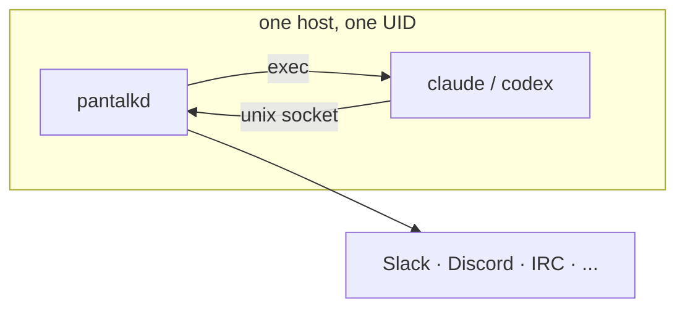
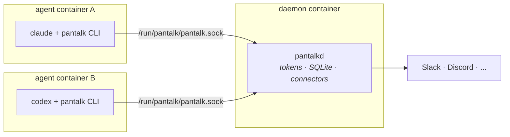

# Deployment

Pantalk is two processes and one socket. `pantalkd` holds the credentials and
the upstream connections; `pantalk` is a client that speaks JSON over a Unix
domain socket. Every deployment topology below is a different answer to one
question:

> **Where does the harness process run, relative to the daemon?**

Answer that and everything else - isolation, blast radius, volumes, UIDs -
follows.

| Topology                                          | Harness runs        | Isolation                       | Best for                                          |
| ------------------------------------------------- | ------------------- | ------------------------------- | ------------------------------------------------- |
| [1. All-in-one](#1-all-in-one)                     | Inside the daemon   | None between agent and daemon   | Single operator, trusted host, fastest start      |
| [2. Socket export](#2-socket-export)               | Separate container/VM | Filesystem, process, network   | Multiple agents, untrusted agent code, multi-repo |
| [3. Sidecar](#3-sidecar)                           | Peer container in a pod | Same as 2, lifecycle-coupled | Kubernetes, one agent per workload                |
| [4. Pantalk Ghost](#4-pantalk-ghost)                  | Inside a desktop image | Whole-desktop boundary       | Demos, shared team harness, human-in-the-loop     |
| [5. Everything else](#5-everything-else)           | Varies              | Varies                          | macOS, SSH-forwarded, multi-tenant, k8s at scale  |

---

## Read this first: what the socket grants

Every topology below is a decision about who can reach the daemon socket, so it
is worth being precise about what reaching it means.

The daemon listens on a Unix socket created with mode `0600` inside a directory
created with mode `0700`
([`server.go`](../internal/server/server.go), [`paths.go`](../internal/config/paths.go)).
That is the entire access control model. **There is no authentication, no
per-client identity, and no scoping** - the OS decides who may connect, and
anyone who connects gets the whole API:

| Action                            | What a socket client can do                                          |
| --------------------------------- | -------------------------------------------------------------------- |
| `send`, `react`, `typing`         | Post as **any configured bot**, to any channel that bot can reach     |
| `history`, `notifications`        | Read stored messages for **every bot**, not just its own              |
| `clear_history`, `clear_notifications` | Destroy stored state for every bot                               |
| `inject`                          | Fabricate an inbound message - which can **trigger an agent run**     |
| `subscribe`                       | Live-stream all events across all bots                                |
| `reload`                          | Make the daemon re-read config from disk and restart connectors       |

There is no TCP listener. `pantalkd` only ever calls `net.Listen("unix", ...)`
and the client only ever dials `unix` - so exposing the daemon beyond the host
is always something *you* build (see [Reaching a remote daemon](#reaching-a-remote-daemon)),
and you own the authentication for it.

Two further facts shape every design below:

- **The config file is a credential store.** One YAML file holds the tokens for
  every bot. Read access to it is read access to your Slack, Discord, Matrix,
  and Twilio identities.
- **Daemon-launched agents inherit the daemon.** When a `when:` binding fires,
  the daemon `exec`s the harness itself
  ([`agent.go`](../internal/agent/agent.go), [`claude/client.go`](../internal/claude/client.go))
  with no environment scrubbing - same UID, same filesystem, same env vars,
  same socket.

That last point is the whole of Topology 1's caveat, so it gets its own section.

---

## 1. All-in-one

The daemon and the harness share a host, a user, and a process tree. This is
what `pantalkd &`, `pantalk local`, the official Docker image, and Ghost all
do by default.



```yaml
agents:
  - name: engineering
    driver: claude
    workdir: /workspace/project
    claude:
      permission_mode: acceptEdits

bots:
  - name: company-slack
    type: slack
    bot_token: $SLACK_BOT_TOKEN
    app_level_token: $SLACK_APP_LEVEL_TOKEN
    agents:
      - agent: engineering
        when: true
```

```bash
docker run --detach \
  --name pantalk \
  --restart unless-stopped \
  --env-file .env \
  --volume "$HOME/.config/pantalk:/home/pantalk/.config/pantalk:ro" \
  --volume pantalk-data:/home/pantalk/.local/share/pantalk \
  ghcr.io/pantalk/pantalk:latest
```

(The official image ships `pantalk` and `pantalkd` only. A harness has to be
layered on top, or you use Ghost.)

### The caveat: the agent *is* the daemon

Because the harness is a child of `pantalkd`, running as the same user with the
same environment, an agent in this topology has:

- **Full read access to the config file** - every bot token, in cleartext,
  usually at a predictable `~/.config/pantalk/config.yaml`. Mounting it `:ro`
  stops the agent editing it; it does not stop the agent reading it.
- **Full daemon control through the socket** - it can send as any bot, read any
  bot's history, wipe history, and `reload` the daemon. It does not need
  permission to do this; the socket is how it is *supposed* to talk to Pantalk.
- **The daemon's environment**, including the `$SLACK_BOT_TOKEN`-style variables
  the config resolves credentials from ([`config.go`](../internal/config/config.go)).
- **Whatever the harness's own sandbox allows** on the filesystem - and the
  daemon's SQLite database, media store, and WhatsApp session DB all sit under
  that same `$HOME`.

Now combine that with the fact that **the agent's input is untrusted by
construction**. Anyone who can DM the bot, or mention it in a channel it has
joined, gets to put text in front of a harness that holds all of the above. A
successful prompt injection in a public Discord channel is, in this topology, a
credential disclosure and a "post as any bot" primitive.

This is a perfectly reasonable posture for a single operator on a machine they
own, running an agent that answers to their own team. It is not one to reach
for when the agent is reachable by people you do not trust, or when it runs code
you did not write.

### Making Topology 1 defensible

If you stay here, tighten these five things:

1. **Keep the command allowlist.** Without `--allow-exec`, `command:` agents are
   restricted to known harness binaries (claude, codex, copilot, aider, goose,
   opencode, gemini). `--allow-exec` turns the config file into arbitrary
   command execution as the daemon user - only enable it when the config is as
   trusted as the daemon binary.
2. **Constrain the harness, not just Pantalk.** `codex.sandbox: read-only` /
   `workspace-write`, `codex.approval_policy`, and `claude.permission_mode: plan`
   with `allowed_tools`/`disallowed_tools` are the real limits on what an
   injected instruction achieves. `bypassPermissions` plus `--allow-exec` on a
   publicly-reachable bot is the worst combination available.
3. **Set `server.media.attach_roots` narrowly.** Outbound attachments are
   disabled until you list roots, and are read **daemon-side**. A wide root -
   or `/` - lets an injected agent exfiltrate any readable file by attaching it
   to a chat message. Symlinks are resolved before the check.
4. **Scope the bots.** One daemon carries every bot's credentials, so a bot for
   a public community and a bot for `#incidents` in the same daemon share a
   blast radius. Split them across daemons.
5. **Harden the container.** `--read-only` with a `tmpfs` for the socket
   directory, `--cap-drop ALL`, `--security-opt no-new-privileges`, and a
   non-root user (the official image already runs UID 10001).

If any of those five feel insufficient, that is exactly the signal to move to
Topology 2.

---

## 2. Socket export

Keep one daemon. Move the harness out into its own container or VM, and hand it
**only the socket**.



The agent container gets the socket and its own workspace. It does **not** get
the config file, the tokens, the SQLite database, or the media store. That is
the entire point.

### The inversion you have to make

In Topology 1 the daemon drives the agent. Here it cannot - the harness binary
does not exist in the daemon's container, so `driver: claude` and
`driver: codex` have nothing to exec.

**Drop the `agents:` block and invert the flow**: the agent container becomes a
socket client that polls or streams for work and replies through the CLI. This
is the mode the [Pantalk skills](https://github.com/pantalk/skills) are written
for.

```yaml
# daemon config — bots only, no agents section
server:
  socket_path: /run/pantalk/pantalk.sock
  notification_history_size: 1000

bots:
  - name: company-slack
    type: slack
    bot_token: $SLACK_BOT_TOKEN
    app_level_token: $SLACK_APP_LEVEL_TOKEN
```

```bash
# inside the agent container
pantalk stream --bot company-slack --notify --timeout 0 \
  | while read -r event; do handle "$event"; done

pantalk notifications --bot company-slack --unseen --limit 20
pantalk send --bot company-slack --channel C0123 --thread 1711234567.000100 --text "done"
pantalk notifications --bot company-slack --unseen --clear
```

### Five things that will bite you

**1. The socket is `0600` - UIDs must match.**
Group ownership and `fsGroup` do not help; the mode leaves no group bits. The
process in the agent container must run as the **same numeric UID** as the
daemon process, or as root (which bypasses the check and gives that container
root on the shared volume). The official image runs UID 10001; pin the agent
container to it explicitly:

```yaml
user: "10001:10001"
```

**2. Mount the socket's *directory*, not the socket file.**
On startup the daemon removes and recreates the socket path
([`server.go`](../internal/server/server.go)). A bind mount of the file itself
pins the old inode, so every daemon restart silently breaks every client until
they are recreated. Mount the parent directory and let the socket appear inside
it.

**3. The client finds the socket via `XDG_RUNTIME_DIR`.**
There is no `PANTALK_SOCKET` variable. The default resolves to
`$XDG_RUNTIME_DIR/pantalk.sock`, falling back to `/tmp/pantalk-<uid>.sock`. In
the agent container, either set `XDG_RUNTIME_DIR=/run/pantalk` or pass
`--socket /run/pantalk/pantalk.sock` on every invocation. Set the env var - the
skills call the CLI without flags.

**4. `--attach` reads files daemon-side.**
`pantalk send --attach ./report.pdf` sends a *path*, and the daemon opens it
against `server.media.attach_roots`. A file the agent container wrote is
invisible to the daemon unless the same volume is mounted into **both**
containers at the **same path**, and that path is inside `attach_roots`. Skip
attachments entirely if you would rather not share a filesystem at all.

**5. Notifications are shared state, scoped by bot.**
Two agent containers polling the same bot will race, double-answer, and clear
each other's queues. The clean partition is **one bot per agent container**:

```yaml
bots:
  - name: eng-bot      # agent container A polls only this
    type: slack
    bot_token: $SLACK_BOT_TOKEN_ENG
    app_level_token: $SLACK_APP_LEVEL_TOKEN_ENG
  - name: support-bot  # agent container B polls only this
    type: slack
    bot_token: $SLACK_BOT_TOKEN_SUPPORT
    app_level_token: $SLACK_APP_LEVEL_TOKEN_SUPPORT
```

Note this is a coordination boundary, not a security boundary - `--bot eng-bot`
is a convention each container follows, not a restriction the daemon enforces.
Any container with the socket can still act as `support-bot`. If you need that
enforced, run two daemons.

### Compose example

```yaml
name: pantalk-split

services:
  pantalkd:
    image: ghcr.io/pantalk/pantalk:latest
    restart: unless-stopped
    user: '10001:10001'
    env_file: .env
    command: ['--socket', '/run/pantalk/pantalk.sock']
    volumes:
      - ./config:/home/pantalk/.config/pantalk:ro
      - pantalk-data:/home/pantalk/.local/share/pantalk
      - pantalk-run:/run/pantalk
    healthcheck:
      test: ['CMD', 'pantalk', 'bots', '--socket', '/run/pantalk/pantalk.sock']
      interval: 30s
      timeout: 5s
      retries: 3

  agent-eng:
    image: your-registry/harness:latest # claude/codex + the pantalk CLI
    restart: unless-stopped
    user: '10001:10001'
    depends_on:
      pantalkd:
        condition: service_healthy
    environment:
      XDG_RUNTIME_DIR: /run/pantalk
      PANTALK_BOT: eng-bot
    volumes:
      - pantalk-run:/run/pantalk
      - eng-workspace:/workspace
      - agent-eng-auth:/home/agent/.claude

  agent-support:
    image: your-registry/harness:latest
    restart: unless-stopped
    user: '10001:10001'
    depends_on:
      pantalkd:
        condition: service_healthy
    environment:
      XDG_RUNTIME_DIR: /run/pantalk
      PANTALK_BOT: support-bot
    volumes:
      - pantalk-run:/run/pantalk
      - support-workspace:/workspace
      - agent-support-auth:/home/agent/.claude

volumes:
  pantalk-data:
  pantalk-run:
  eng-workspace:
  support-workspace:
  agent-eng-auth:
  agent-support-auth:
```

The workspaces are deliberately separate volumes. Each agent sees one repo; none
of them sees the tokens.

### What this buys, and what it does not

Gained: the config file, the tokens, the message database, and the media store
leave the agent's reach. Each agent gets an independent filesystem, its own
harness authentication, its own resource limits, and its own network policy -
you can deny the agent container all egress except the socket and its git
remote, while the daemon keeps the egress it needs for Slack and Discord.

Still shared: **any container holding the socket can act as any bot and read
every bot's history.** Socket export contains the *credentials*; it does not
partition the *daemon API*. Genuine mutual isolation between agents means one
daemon per agent - see [Multi-tenancy](#multi-tenancy-one-daemon-per-trust-boundary).

### Virtual machines

Same shape, different plumbing for the last hop:

- **Firecracker / QEMU / Cloud Hypervisor** - expose the socket over `virtio-vsock`
  and `socat` it to a Unix path inside the guest.
- **Plain VMs on the same host** - a virtiofs or 9p share carrying the socket
  directory works, with the same UID-matching requirement.
- **Anything over a network** - see below.

### Reaching a remote daemon

The protocol is unauthenticated and unencrypted, because a `0600` Unix socket
made both unnecessary. Any relay you build must restore both.

```bash
# Good: SSH carries the authentication and the encryption.
ssh -N -L /local/run/pantalk.sock:/run/user/1000/pantalk.sock agent@daemon-host
XDG_RUNTIME_DIR=/local/run pantalk bots
```

```bash
# NEVER do this. It is an unauthenticated remote "send as any bot" API.
socat TCP-LISTEN:9999,fork UNIX-CONNECT:/run/pantalk/pantalk.sock
```

If SSH does not fit, terminate with mTLS (`socat` with `OPENSSL-LISTEN` and
`verify=1`, or a service mesh), bind to a private interface, and treat the
endpoint as production-sensitive. Do not put it on `0.0.0.0`.

---

## 3. Sidecar

A variation of Topology 2 where the daemon and one agent share a **pod
lifecycle** rather than just a socket. Two directions, depending on which side
you consider the workload.

### 3a. Agent sidecar - one daemon, agents attached to it

The daemon is the long-lived service; each agent is a container beside it,
scaled and restarted independently. This is the Compose example above,
tightened into a pod.

### 3b. Daemon sidecar - one daemon per workload

Invert it: the *agent* is the workload, and `pantalkd` rides along as its chat
adapter, exactly the way a logging or proxy sidecar does. Each workload gets its
own daemon, its own config, and its own bot credentials, so the shared-daemon
caveat from Topology 2 disappears - there is nothing to share.

This costs one daemon process and one SQLite database per workload, which is
cheap (a static Go binary, no external dependencies) and is the only shape that
gives agents genuine mutual isolation.

### Kubernetes

```yaml
apiVersion: apps/v1
kind: StatefulSet
metadata:
  name: pantalk
spec:
  replicas: 1 # see below — this is not a typo
  serviceName: pantalk
  selector:
    matchLabels: { app: pantalk }
  template:
    metadata:
      labels: { app: pantalk }
    spec:
      securityContext:
        runAsUser: 10001 # must match across BOTH containers
        runAsGroup: 10001
        runAsNonRoot: true
      volumes:
        - name: run
          emptyDir: {} # the socket lives here
        - name: config
          secret: { secretName: pantalk-config }
      containers:
        - name: pantalkd
          image: ghcr.io/pantalk/pantalk:latest
          args: ['--socket', '/run/pantalk/pantalk.sock']
          env:
            - name: PANTALK_CONFIG
              value: /etc/pantalk/config.yaml
            - name: SLACK_BOT_TOKEN
              valueFrom:
                secretKeyRef: { name: pantalk-tokens, key: slack-bot-token }
            - name: SLACK_APP_LEVEL_TOKEN
              valueFrom:
                secretKeyRef: { name: pantalk-tokens, key: slack-app-token }
          volumeMounts:
            - { name: run, mountPath: /run/pantalk }
            - { name: config, mountPath: /etc/pantalk, readOnly: true }
            - { name: data, mountPath: /home/pantalk/.local/share/pantalk }
          readinessProbe:
            exec:
              command: ['pantalk', 'bots', '--socket', '/run/pantalk/pantalk.sock']
            initialDelaySeconds: 5
            periodSeconds: 30
          securityContext:
            allowPrivilegeEscalation: false
            capabilities: { drop: ['ALL'] }

        - name: agent
          image: your-registry/harness:latest
          env:
            - name: XDG_RUNTIME_DIR
              value: /run/pantalk
          volumeMounts:
            - { name: run, mountPath: /run/pantalk }
            - { name: workspace, mountPath: /workspace }
          securityContext:
            allowPrivilegeEscalation: false
            capabilities: { drop: ['ALL'] }
  volumeClaimTemplates:
    - metadata: { name: data }
      spec:
        accessModes: ['ReadWriteOnce']
        resources: { requests: { storage: 5Gi } }
    - metadata: { name: workspace }
      spec:
        accessModes: ['ReadWriteOnce']
        resources: { requests: { storage: 20Gi } }
```

Four Kubernetes-specific notes:

- **`replicas: 1`, and it is not negotiable.** State is SQLite on a `ReadWriteOnce`
  volume, and the connectors hold stateful upstream sessions - Slack Socket Mode,
  the Discord Gateway, Telegram long-poll. A second replica means duplicate
  event consumption and double replies. Scale by adding *daemons with different
  bots*, never replicas of one.
- **`emptyDir` for the socket, and matching `runAsUser`.** `fsGroup` cannot
  rescue a `0600` file; both containers must be the same UID.
- **`RollingUpdate` will not work** with an RWO volume and a single replica. Use
  `strategy`/`updateStrategy` semantics that stop before starting (`OnDelete`, or
  accept the brief gap) - a chat daemon reconnecting is not a user-visible
  outage.
- **Config as a Secret, not a ConfigMap.** Even with `$ENV` indirection for the
  tokens, the file names your bots and topology.

---

## 4. Pantalk Ghost

[Pantalk Ghost](https://github.com/pantalk/ghost) inverts the whole
question: instead of shipping a harness *to* the daemon, it ships a **desktop
that already contains both**. `pantalkd`, Codex, and Claude Code are installed
and registered as agents; KasmVNC serves the desktop over HTTP so you reach it
from a browser.

```bash
docker run --detach \
  --name pantalk-ghost \
  --shm-size 1g \
  --publish 127.0.0.1:6902:6901 \
  ghcr.io/pantalk/ghost:latest
```

Architecturally this is **Topology 1 with a UI on it** - the agents and the
daemon share a user and a filesystem inside the image, so the caveat from
[§1](#the-caveat-the-agent-is-the-daemon) applies in full, plus the desktop
itself.

### Ready-made deployment recipes

Ghost's repository carries complete Compose deployments that stand up Ghost
*and* a messaging server together. They are the fastest end-to-end path, and the
best worked examples to copy from:

| Recipe                   | Brings up                                        |
| ------------------------ | ------------------------------------------------ |
| `deployments/mattermost` | Mattermost Team Edition + PostgreSQL + Ghost      |
| `deployments/ergo`       | Ergo IRC server + The Lounge web client + Ghost   |

```bash
cd deployments/mattermost
make up          # generates .env, starts Mattermost, provisions bots, starts Ghost
make credentials # print the generated admin login
make smoke       # live end-to-end messaging test
make down        # stop, preserving all volumes
```

`make up` provisions a `pantalk` team, an `agents` channel, and `codex` and
`claude` bot accounts; writes their tokens into the gitignored `.state/`
directory; renders `config/pantalk.yaml.tmpl` into a real Pantalk config; and
mounts it over Ghost's transport-neutral starter. Then you open
<http://127.0.0.1:6902>, use the desktop's **Setup** menu to log into Codex or
Claude Code once, and DM `@codex` or `@claude` in Mattermost.

The pattern worth stealing regardless of which chat system you run:

```yaml
bots:
  - name: codex
    type: mattermost
    endpoint: http://mattermost:8065
    bot_token: __CODEX_TOKEN__
    agents:
      - agent: codex
        when: direct || mentions # NOT `when: true`
```

`direct || mentions` rather than `when: true` is what stops two agents in the
same channel answering each other in a loop. Copy that.

The deployments also demonstrate the claim Ghost exists to make: the Ghost
image is byte-identical between the Mattermost and Ergo recipes. Only the
mounted Pantalk config differs, and the agent definitions carry across
untouched.

### Ghost's declared security posture

Ghost documents itself as a **single-tenant, trusted-host environment**, and
means it:

- KasmVNC has **no browser password**.
- Codex runs `sandbox: workspace-write`, `approval_policy: never` inside `/workspace`.
- Claude runs `permission_mode: acceptEdits`.
- The desktop user has passwordless `sudo`.

So: **do not publish port 6901, and do not change `BIND_ADDRESS`, on an
untrusted host.** The default binding is `127.0.0.1` deliberately.

What the team shares is the *harness through chat*, not the desktop. That
distinction is the deployment model: run Ghost somewhere you control, put it
behind an authenticating reverse proxy or a VPN/tunnel if it must be remote, and
let Pantalk be the front door. Sessions are keyed by service, bot, channel,
thread, and user, so each teammate reaching it through chat still gets an
isolated conversation - **one harness subscription, no per-person seat, no
per-person terminal.**

### When Ghost is the right production answer

It genuinely is, for: a shared team assistant on an internal host;
human-in-the-loop work where someone occasionally wants to watch or take over at
the desktop; and anything needing a real browser or GUI tooling next to the
agent.

It is the wrong answer for: multi-tenant use, agents reachable by untrusted
users, or unattended fleets - the desktop, the passwordless sudo, and the
permissive harness defaults are all cost with no benefit there. Use Topology 2
or 3.

---

## 5. Everything else

### Multi-tenancy: one daemon per trust boundary

The single most useful rule in this document. Because one daemon holds every
bot's credentials and grants full API access to every socket client, **the
daemon is the unit of isolation.** Two things belong in different daemons
whenever they belong to different trust boundaries:

| Split by      | Example                                                      |
| ------------- | ------------------------------------------------------------ |
| Audience      | Public community Discord vs. internal `#incidents` Slack     |
| Repository    | Each daemon's agents see one workspace                        |
| Environment   | Staging bots never share a daemon with production bots        |
| Customer      | One daemon per tenant, always                                 |

Each daemon needs its own `--socket`, `--db`, and config path. It is a single
static Go binary with SQLite and no external dependencies - running ten of them
is cheap, and it is the only partition the architecture actually enforces.

### Systemd on a plain VM

No containers needed, and the hardening directives map cleanly onto the concerns
above:

```ini
# ~/.config/systemd/user/pantalkd.service
[Unit]
Description=Pantalk daemon
After=network-online.target

[Service]
ExecStart=%h/.local/bin/pantalkd --config %h/.config/pantalk/config.yaml
ExecReload=%h/.local/bin/pantalk reload
Restart=on-failure
RestartSec=5
Environment=XDG_RUNTIME_DIR=%t

# Hardening
NoNewPrivileges=true
PrivateTmp=true
ProtectSystem=strict
ProtectHome=read-only
ReadWritePaths=%h/.local/share/pantalk
ProtectKernelTunables=true
ProtectControlGroups=true
RestrictSUIDSGID=true
LockPersonality=true

[Install]
WantedBy=default.target
```

```bash
systemctl --user enable --now pantalkd
loginctl enable-linger "$USER"   # keeps it running after logout
```

Note that `ProtectHome=read-only` plus a narrow `ReadWritePaths` is incompatible
with daemon-launched agents that need to write to a repo - which is a feature
if you are running Topology 2, and something to relax deliberately if you are
not.

### SSH-forwarded socket: laptop harness, server daemon

A pleasant middle ground for solo work. The daemon lives on an always-on box
holding the tokens; the harness runs on your laptop where your repo and
credentials already are.

```bash
ssh -N -L /home/me/.run/pantalk.sock:/run/user/1000/pantalk.sock ops@daemon-host &
XDG_RUNTIME_DIR=/home/me/.run pantalk notifications --bot company-slack --unseen
```

Same UID caveat does not apply here (SSH proxies the bytes rather than sharing
the filesystem), and SSH supplies the authentication the protocol lacks.

### macOS and iMessage cannot be containerized

The iMessage connector reads `~/Library/Messages/chat.db` and sends via
AppleScript. That requires a real macOS user session, and the process needs
**Full Disk Access** granted in System Settings. Run `pantalkd` as a launchd
user agent on a Mac; there is no container story. If the rest of your fleet is
Linux, run the iMessage daemon separately and treat it as its own tenant.

### WhatsApp needs an interactive first boot

WhatsApp authenticates by QR pairing, not by token:

```bash
pantalk pair --bot my-whatsapp   # scan the QR from the terminal
```

Deployment consequences: the pairing terminal must be interactive (in Docker,
`docker exec -it`), and the resulting session lives in a SQLite file that
**must** be on a persistent volume - lose it and you re-pair by hand. Pair once,
then let the daemon start unattended.

### Secrets

`ResolveCredential` supports literal values and `$ENV_VAR` / `${ENV_VAR}`
references, and fails startup if a referenced variable is unset. It reads
**environment variables only** - there is no `_FILE` indirection, so Docker
secrets and Kubernetes secret *files* need to be projected into env vars
(`env.valueFrom.secretKeyRef`, or an entrypoint that exports them) rather than
mounted as paths.

Always use `$VAR` references rather than literals in the YAML, so the config
file can be reviewed, diffed, and mounted read-only without carrying the tokens
itself. Keep the config mounted `:ro` in every topology.

### Persistence, backup, restore

| Path                                              | Contents                          | Loss impact                     |
| ------------------------------------------------- | --------------------------------- | ------------------------------- |
| `~/.local/share/pantalk/pantalk.db`               | History, notifications, sessions  | Agents lose conversation continuity |
| `~/.local/share/pantalk/media/`                   | Attachment bytes (content-addressed) | History rows outlive their files |
| `~/.local/share/pantalk/whatsapp-<bot>.db`        | WhatsApp session                  | Manual re-pairing required      |
| `~/.config/pantalk/config.yaml`                   | Bots, agents, credentials refs    | Rebuild from source control     |
| Harness auth (`~/.claude`, `~/.codex`)            | Harness login                     | Re-authenticate each harness    |

Back up the data directory as a unit - the database and the media store
reference each other, and unreferenced media is garbage-collected on startup, so
a database-only restore silently drops attachments. Stop the daemon or use SQLite's
online backup rather than copying the file under load.

### Upgrades and reload

- **`pantalk reload`** re-reads config and restarts connectors in place. It
  handles bot and agent changes, and is the right tool for adding a platform or
  swapping a `driver:`.
- **It cannot change `socket_path` or `db_path`** at runtime - those need a
  daemon restart, which is also the moment every client's socket handle is
  invalidated (see the bind-mount gotcha in [§2](#five-things-that-will-bite-you)).
- **Config is strictly validated**: unknown keys are a hard load failure. Run
  `pantalk validate` in CI against your rendered config before shipping it.
- **Version the daemon and the image together.** Ghost pins its Pantalk
  release via a build argument for exactly this reason.

### Observability

- Logs go to stdout - collect them with your normal container or journal
  pipeline. `--debug` adds per-request action/service/bot logging.
- `pantalk ping` and `pantalk bots` are the health checks; the official image
  already uses `pantalk bots` in its `HEALTHCHECK`.
- `pantalk status` reports connector state, which is the thing to alert on -
  upstream sessions can drop without the process dying.
- `pantalk stream --bot X --notify --timeout 0` is a live event tap that is
  useful for debugging routing without touching the harness.

### Network egress

The daemon needs outbound access to each platform (Slack, Discord, Telegram,
Matrix, Twilio, your IRC/XMPP/Mattermost host, Nostr relays). Agent containers
need whatever their harness needs - the model API and your git remote. In
Topologies 2 and 3 those are two different, much narrower egress policies on two
different containers, which is one more reason to prefer them: the container
handling untrusted chat input does not need to reach the internet at all beyond
its model endpoint.

---

## Choosing

- **Just me, my machine, my team's Slack** → Topology 1, plus the five hardening
  steps.
- **Want to see it working in ten minutes** → Topology 4, `deployments/mattermost`.
- **Agent reachable by people I don't fully trust** → Topology 2. The tokens must
  leave the agent's reach.
- **Several agents, several repos, one chat estate** → Topology 2 with one bot per
  agent container.
- **Kubernetes** → Topology 3, `replicas: 1`, matching `runAsUser`, socket on an
  `emptyDir`.
- **Multiple customers, environments, or audiences** → one daemon per boundary,
  every time. Nothing below that line is enforced.

## See also

- [`agents.md`](agents.md) - drivers, `when:` bindings, scheduled prompts
- [`claude-agent.md`](claude-agent.md) / [`codex-agent.md`](codex-agent.md) - harness-side permission and sandbox settings
- [`local-connector.md`](local-connector.md) - credential-free connector for testing a deployment
- [Pantalk Ghost](https://github.com/pantalk/ghost) - the desktop image and its deployment recipes
