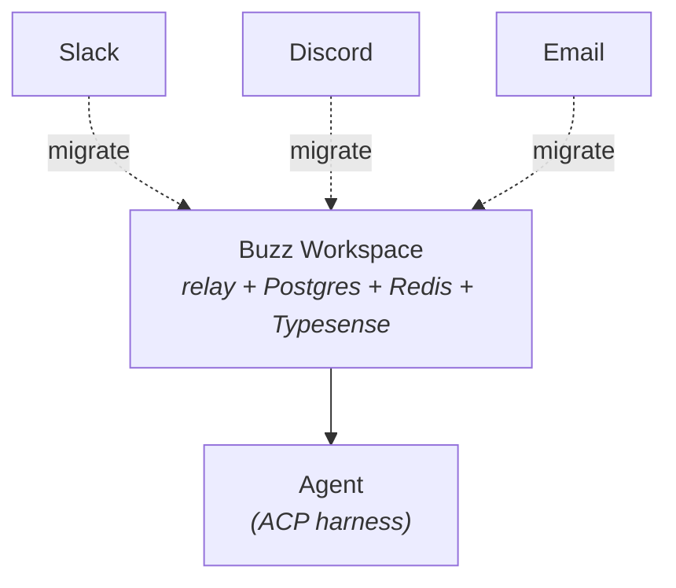
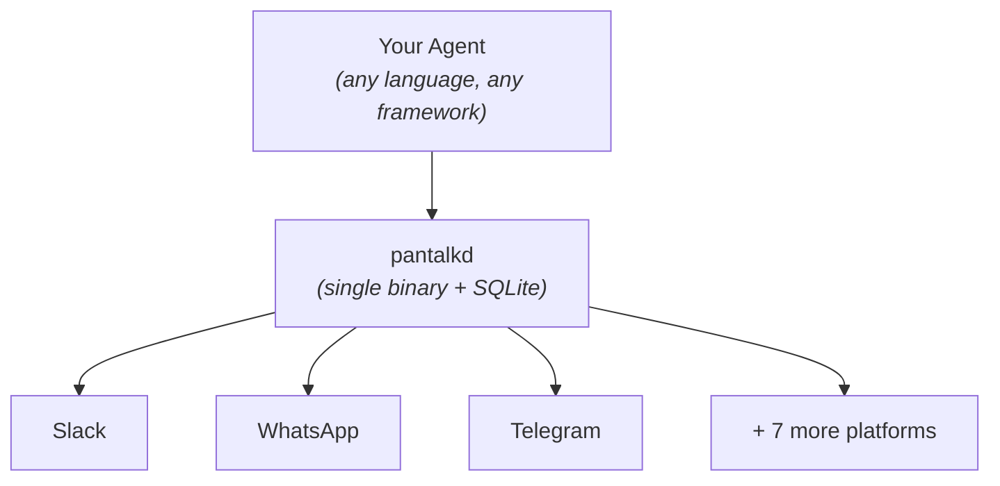

# Pantalk vs Buzz

[Buzz](https://github.com/block/buzz) and Pantalk answer the same question - *how does an AI agent become a real participant in your team's conversations?* - and they answer it in opposite directions.

**Buzz consolidates.** It gives you a new workspace where humans and agents are both first-class members, and asks your team to move there.

**Pantalk federates.** It leaves your team exactly where they are and bridges the ten platforms they already use into one agent-addressable stream.

Both give an agent a unified event stream, a way to be mentioned, and a runner that launches it on demand. The difference is whether that unification happens by **moving people** or by **bridging platforms**.

---

## Two Topologies

**Buzz** - one workspace, everyone joins it:

**Pantalk** - no workspace, the daemon reaches out:

---

## Side by Side

|                       | Buzz                                                     | Pantalk                                                       |
| --------------------- | -------------------------------------------------------- | ------------------------------------------------------------- |
| **Model**             | A workspace you host and join                            | A daemon that bridges platforms you already use               |
| **Adoption cost**     | Your team migrates                                        | Nothing changes for anyone                                     |
| **Reach**             | People inside the Buzz workspace                          | Slack, Discord, Mattermost, Telegram, WhatsApp, IRC, Matrix, Twilio/SMS, Zulip, iMessage |
| **Infrastructure**    | Relay + Postgres + Redis + Typesense                      | One binary, SQLite, no external services                      |
| **Runs on**           | A server you operate                                      | Your laptop, a VPS, or a container                            |
| **Protocol**          | Nostr (NIP-01/29/42), signed events                       | Each platform's native protocol, normalized                   |
| **Agent identity**    | Native member with its own keypair and audit trail        | A bot account per platform, presented as one identity         |
| **Agent runner**      | ACP harness (`BUZZ_ACP_AGENT_COMMAND`)                    | Reusable agents with ordered per-bot `when:` bindings          |
| **Agent interface**   | JSON in / JSON out CLI                                    | JSON over a Unix socket, plus a CLI                           |
| **History**           | Full-text search across the workspace (NIP-50)            | Local SQLite across every connected platform                  |
| **Language**          | Rust                                                      | Go                                                             |
| **License**           | Apache-2.0                                                | See [LICENSE](../LICENSE)                                      |

---

## What Buzz Does That Pantalk Doesn't

Worth being straight about: within its own workspace, Buzz is deeper than Pantalk will ever be, because it owns the whole substrate.

- **Cryptographic identity per agent.** Every participant signs with its own keypair. Access is scoped by identity rather than permission flags, and the audit trail is inherent rather than reconstructed. Pantalk's agent is a bot account, and inherits whatever governance the host platform offers.
- **Receipts.** Messages, patches, CI results, git events, and approval decisions all land in one signed log, so "ask the project a question and get an answer with receipts" actually works. Pantalk normalizes messages - not your build system.
- **Workspace primitives.** Channels, canvases, workflows, and code review are native objects an agent can manipulate. Pantalk has messages, threads, and reactions.
- **It is a product, not a bridge.** Buzz ships a desktop app, a mobile app, and a push gateway.

If you can move your team, and you want one audited log for everything, Buzz is a stronger answer than Pantalk. Pantalk is not trying to be a workspace.

## What Pantalk Does That Buzz Doesn't

- **Meets humans where they already are.** This is the whole thesis. The hardest part of agent adoption is not the agent - it is getting people to change where they talk. Pantalk's adoption cost is zero: your colleagues keep using Slack, your customers keep using WhatsApp, your on-call keeps getting SMS.
- **Ten platforms, one interface.** One reusable agent definition can be bound by multiple bots. A single runtime can be mentioned in Slack, DM'd on Telegram, and texted over Twilio while each conversation keeps an isolated session.
- **Reachable from a phone with no app.** WhatsApp, SMS, and iMessage mean your agent is reachable by anyone with a phone number, including people who will never install anything.
- **No infrastructure.** A single binary and a SQLite file. No Postgres, no Redis, no search cluster, no server to operate.
- **Works with platforms you don't control.** You can bridge a customer's Slack or a community's IRC channel. You cannot ask them to join your workspace.

The trade is fidelity: Pantalk normalizes to what every platform can express, so the feature floor is the lowest common denominator. Reactions, for instance, are not supported on every connector.

---

## Choosing

**Choose Buzz if** you can move your team into a new workspace, you want one audited event log spanning chat and code, and you need cryptographically scoped per-agent access.

**Choose Pantalk if** your humans are already somewhere else and won't move, you need reach across several platforms at once, or you want your agent talking to people today without operating a server.

They are not really competing for the same slot. Buzz is where your team could work. Pantalk is how your agent reaches the places your team already works.

---

## Could Pantalk Just Connect to Buzz?

Technically, yes - Buzz is a Nostr relay, and a `nostr` connector speaking NIP-01/29/42 would reach it like any other platform.

But it would be the least useful connector in the set, because Buzz already ships Pantalk's core feature. Its ACP harness spawns an agent binary on mentions with a channel allowlist, turn timeouts, and dedup—the same job as Pantalk's per-bot agent bindings. Routing through Pantalk would also *downgrade* the agent, collapsing a native member with its own keypair and audit trail into a single relay identity forwarding text.

The shape that would genuinely add something is the reverse: bridging a Buzz channel *out* to the Slack, WhatsApp, or SMS where everyone else is. That remains open.

---

## See Also

- [Agents](agents.md) - launch AI agents automatically when matching notifications arrive
- [Claude Code Hooks](claude-code-hooks.md) - use Pantalk as a Claude Code hook
- [Platform Setup](../README.md#platform-setup) - per-platform connection guides
