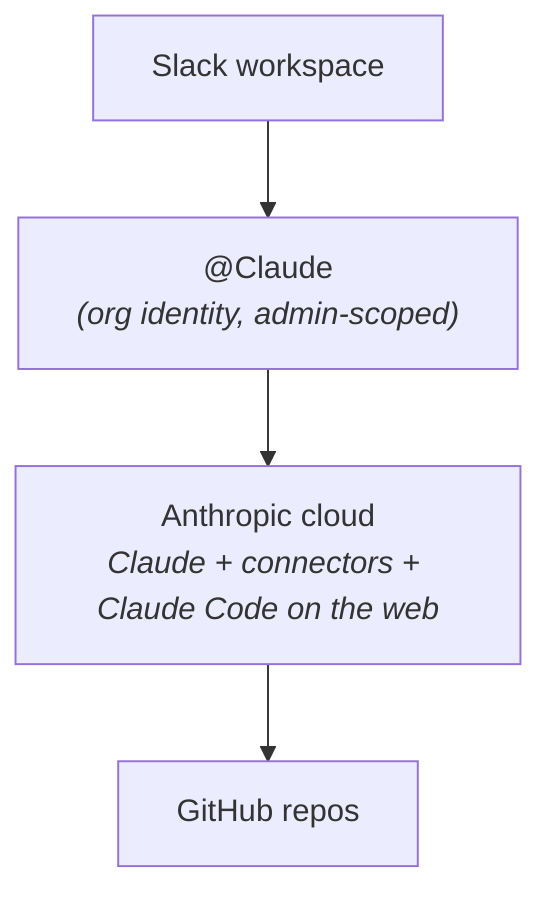
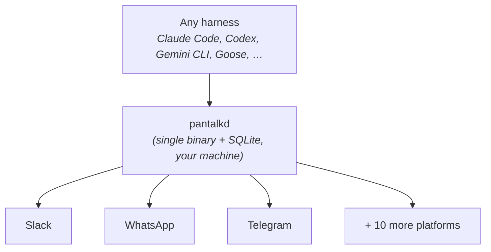

# Pantalk vs Claude Tag

[Claude Tag](https://claude.com/product/tag) and Pantalk answer the same question - *how does an AI agent become a real participant in your team's conversations?* - and they answer it with opposite commitments.

**Claude Tag is one agent in one place.** `@Claude` becomes a shared organizational identity in Slack, hosted and operated by Anthropic, with admin-configured access per channel.

**Pantalk is any agent in any place.** It runs a daemon you own that carries whichever harness you choose onto thirteen messaging platforms.

Both give you an agent that is mentioned like a teammate, keeps conversation context, works asynchronously, and replies in the thread. The difference is where the boundaries are drawn.

Claude Tag decides both ends of the pair for you: the harness is Claude, the platform is Slack. That is a coherent product decision - owning both ends is exactly what lets it offer org memory, per-channel tool scoping, and spend controls. It is also the thing you cannot change. Pantalk welds neither end: harnesses attach through drivers, platforms through connectors, and the two are declared in blocks that never reference each other.

---

## Two Topologies

**Claude Tag** - Anthropic's agent, inside Slack:

**Pantalk** - your harness, on your machine, reaching everywhere:

---

## Side by Side

|                        | Claude Tag                                                              | Pantalk                                                                                                                     |
| ---------------------- | ----------------------------------------------------------------------- | --------------------------------------------------------------------------------------------------------------------------- |
| **Model**              | A managed agent that lives in your Slack workspace                      | A daemon that carries your agent onto the platforms you already use                                                          |
| **Platforms**          | Slack (expansion stated as roadmap)                                      | Slack, Discord, Mattermost, Telegram, WhatsApp, IRC, XMPP/Jabber, Twitch, Nostr, Matrix, Twilio/SMS, Zulip, iMessage         |
| **Harness**            | Claude                                                                   | Native drivers for Claude Code and Codex; `command` driver for Copilot, Gemini CLI, Goose, OpenCode, Aider, and anything else |
| **Who operates it**    | Anthropic                                                                | You                                                                                                                          |
| **Runs on**            | Anthropic's cloud                                                        | Your laptop, a VPS, or a container                                                                                           |
| **Where code work happens** | Claude Code on the web, against connected GitHub repositories       | Your working directory, on the machine running `pantalkd`                                                                    |
| **Availability**       | Beta, Claude Enterprise and Team plans                                   | Any account your chosen harness can authenticate                                                                             |
| **Agent identity**     | One org-wide `@Claude`, admin-configured                                 | A bot account per platform, one or many, presented as one identity                                                           |
| **Routing**            | Channel membership plus admin policy; intent detection picks chat vs. code | Ordered per-bot `when:` bindings over channel, thread, DM, mention, text, and time                                            |
| **Memory**             | Shared per-channel context that accumulates over time                    | Per-conversation harness sessions, isolated by agent, service, bot, DM, channel, and thread                                  |
| **Governance**         | Admin console: per-channel data and tool scoping, token spend limits, activity logs | Whatever the host platform and your harness's own permission model provide                                              |
| **Initiative**         | Ambient follow-ups and proactive flagging when enabled                   | Responds to notifications; scheduled bindings for recurring work                                                             |
| **Infrastructure**     | None to run                                                              | One binary, SQLite, no external services                                                                                     |
| **History**            | In Slack and Anthropic's session store                                   | Local SQLite across every connected platform                                                                                 |
| **License**            | Commercial product                                                       | See [LICENSE](../LICENSE)                                                                                                    |

---

## What Claude Tag Does That Pantalk Doesn't

Worth being straight about: inside a Slack workspace, Claude Tag is a deeper product than Pantalk intends to be, precisely because Anthropic owns both the model and the surface.

- **Organizational memory.** One Claude interacts with everyone in a channel and accumulates shared context over time, so it gets better at your company the longer it sits there. Pantalk's sessions are per-conversation and per-harness; continuity is whatever your harness persists.
- **Admin governance as a first-class feature.** Access to data sources and tools is scoped per channel, spend is capped per organization and per channel, and there is a complete activity log. Pantalk has no console and no budget - it inherits the host platform's governance and your harness's permission model.
- **Ambient participation.** With proactive behavior enabled, Claude flags relevant information and follows up on unresolved threads without being asked. Pantalk acts on notifications and clock ticks; it does not read a channel and decide to interject.
- **Nothing to operate.** No daemon, no tokens to rotate, no host. Pantalk is a process you have to keep alive.
- **Managed connector ecosystem.** Claude's connectors reach org data sources under admin control. Pantalk normalizes messages; anything else is your harness's job.

If your team lives in Slack, you are on a Team or Enterprise plan, and you want an agent your admins can actually govern, Claude Tag is the stronger answer. Pantalk is not trying to be a managed product.

## What Pantalk Does That Claude Tag Doesn't

- **Thirteen platforms instead of one.** This is the whole thesis. Claude Tag brings an agent to the place Anthropic supports; Pantalk brings one to the places your people actually are. Your colleagues are in Slack, your community is on Discord or IRC, your customers are on WhatsApp, your on-call gets SMS - the same agent definition serves all of them, each conversation with its own isolated session.
- **Reachable from a phone with no app and no account.** WhatsApp, SMS, and iMessage mean anyone with a phone number can reach your agent, including people who will never be provisioned a seat in your Slack.
- **Any harness, not just Claude.** `driver:` is a one-line edit. Route `#code-review` to Claude Code and everything else to Codex, or replace both next quarter without touching a single platform integration. [Pantalk Ghost](https://github.com/pantalk/ghost) ships both harnesses preinstalled and demonstrates exactly this swap.
- **Runs where your code actually is.** The harness executes in a working directory on your machine, with your local checkout, your `CLAUDE.md`, your skills, your MCP servers, and your existing CLI authentication. That covers self-hosted GitLab, Gitea, monorepos too large to sync, private networks, and anything else a cloud sandbox with GitHub-only repository access cannot see.
- **No plan gate.** Claude Tag is beta for Enterprise and Team. Pantalk runs whatever CLI you already have logged in - a personal Claude Code or Codex login is enough to have an agent answering messages this afternoon.
- **Direct messages, and platforms you don't control.** Pantalk treats DMs as a first-class route on every provider that distinguishes them, and you can bridge a customer's Slack, a community's IRC channel, or a Nostr relay - none of which you could ask to install an org-wide app.
- **Your data path stays yours.** Message history lives in a local SQLite file. Nothing traverses a vendor beyond the model provider your harness already talks to.
- **Explicit routing and schedules.** `when:` expressions decide which agent answers which conversation, in written order, plus `at("09:00")` and `every("30m")` bindings for recurring work. Nothing is inferred.

The trade is depth for reach. Pantalk normalizes to what every platform can express, so the feature floor is the lowest common denominator - reactions, for instance, are not supported on every connector. And there is no org memory, no admin console, and no spend cap, because Pantalk does not own the model.

---

## They Are Not Mutually Exclusive

Nothing stops you running both. Claude Tag can be the governed, org-wide `@Claude` in your Slack while a Pantalk bot serves the twelve places Claude Tag does not reach - the community Discord, the customer WhatsApp thread, the on-call SMS number, the Twitch chat.

Pantalk's own Slack connector runs as a separate bot account with its own token, so it coexists in the same workspace under a different name. Point it at a repository your cloud sandbox cannot reach, or at a harness that is not Claude, and the two do not overlap.

---

## Choosing

**Choose Claude Tag if** your team is in Slack and staying there, you are on Team or Enterprise, you want admin-scoped access and spend controls, and you would rather not operate anything.

**Choose Pantalk if** your humans are spread across several platforms, you need an agent working in a local or private repository, you expect to change harnesses, you want DM and phone reach, or you want an agent talking to people today without a plan upgrade or an admin approval.

The honest framing: Claude Tag is how Claude becomes a member of your Slack workspace. Pantalk is how *any* agent becomes reachable everywhere else.

---

## See Also

- [Pantalk vs Codex in Slack](pantalk-vs-codex-slack.md) - the same comparison against OpenAI's Slack agent
- [Pantalk vs Buzz](pantalk-vs-buzz.md) - the same comparison against a workspace-first approach
- [Agents](agents.md) - bind any harness to any bot with drivers and `when:` routing
- [Claude Agent](claude-agent.md) / [Codex Agent](codex-agent.md) - the native harness drivers
- [Claude Code Hooks](claude-code-hooks.md) - use Pantalk as a Claude Code hook
- [Slack Setup](slack-setup.md) - connecting Pantalk's own Slack bot
- [Pantalk Ghost](https://github.com/pantalk/ghost) - prebuilt desktop showing the whole thing working
