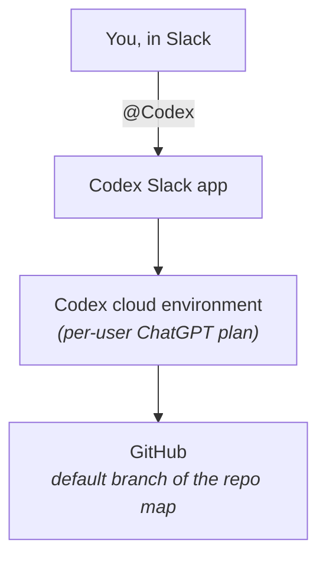
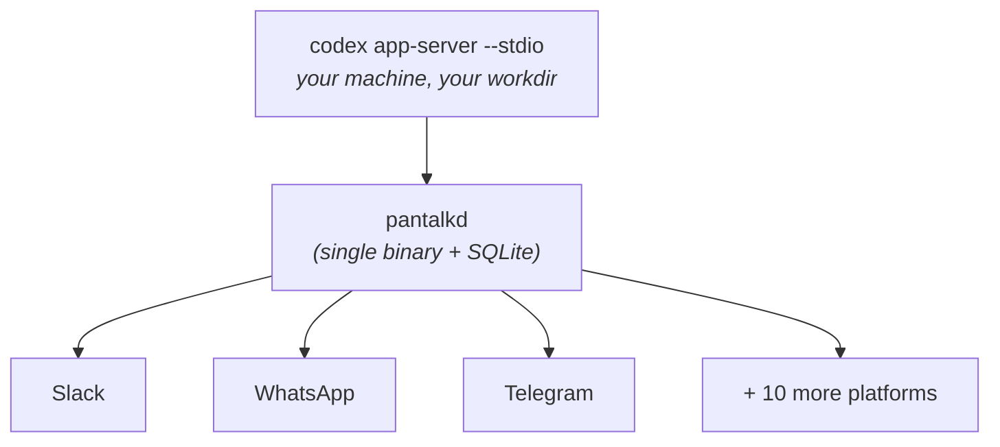

# Pantalk vs Codex in Slack

[Codex in Slack](https://developers.openai.com/codex/integrations/slack) is unusual among the things Pantalk gets compared to, because it is not a rival agent. It is the *same* agent.

Pantalk ships a native `codex` driver. OpenAI ships a Slack app. Both put Codex in a chat thread. The disagreement is about where Codex runs and how many places can reach it.

**Codex in Slack runs Codex in OpenAI's cloud.** You tag `@Codex` in a channel, it picks one of your configured cloud environments, works against the default branch of a GitHub repository, and posts a link to the completed task.

**Pantalk runs Codex on your machine.** `pantalkd` owns a `codex app-server --stdio` process pointed at a working directory you choose, and carries it onto thirteen messaging platforms.

Same binary. Opposite topology.

---

## Two Topologies

**Codex in Slack** - your message travels to the code:

**Pantalk** - the code stays put and reaches out:

---

## Side by Side

|                          | Codex in Slack                                                          | Pantalk                                                                                                         |
| ------------------------ | ----------------------------------------------------------------------- | ----------------------------------------------------------------------------------------------------------------- |
| **Platforms**            | Slack                                                                    | Slack, Discord, Mattermost, Telegram, WhatsApp, IRC, XMPP/Jabber, Twitch, Nostr, Matrix, Twilio/SMS, Zulip, iMessage |
| **Harness**              | Codex                                                                    | Codex, Claude Code, or anything else through the `command` driver                                                   |
| **Where Codex runs**     | OpenAI cloud environments                                                | Your machine, as a process `pantalkd` owns                                                                          |
| **Code it can see**      | GitHub repositories, default branch of the environment's repo map        | Whatever is in `workdir` - branches, uncommitted changes, generated files, sibling repos                            |
| **Source control**       | GitHub                                                                   | Anything on disk: GitLab, Gitea, self-hosted, or no VCS at all                                                       |
| **Who needs an account** | Every participant needs a ChatGPT plan, GitHub connection, and environment | One authenticated Codex install on the host; everyone else just sends messages                                     |
| **Plans**                | ChatGPT Plus, Pro, Business, Edu, Enterprise                             | Whatever your local Codex login already is                                                                          |
| **Repo selection**       | Inferred from the request, or named inline (`in openai/codex`)            | Pinned per agent definition; define several agents for several repos                                                |
| **Sandbox / approvals**  | OpenAI's environment settings                                            | `sandbox` and `approval_policy` in your YAML, defaulting to your local Codex config                                 |
| **Routing**              | Channel membership plus intent                                           | Ordered `when:` bindings over channel, thread, DM, mention, text, and time                                          |
| **Scheduled work**       | -                                                                        | `at("09:00")` and `every("30m")` bindings                                                                           |
| **Attribution**          | Each task runs under the requesting user's own account and repo permissions | One shared harness identity for everyone                                                                          |
| **Where results live**   | Codex cloud, linked from the thread                                      | The thread, plus local SQLite history                                                                               |
| **Infrastructure**       | None to run                                                              | One binary, SQLite, no external services                                                                             |

---

## What Codex in Slack Does That Pantalk Doesn't

- **Per-user identity and permissions.** Every task runs under the requesting person's own ChatGPT account and their own GitHub access, so attribution and repository permissions are real. This is Pantalk's clearest weakness: one authenticated harness answers everyone, which means one identity and one permission set. Convenient for a team that already shares a repo; wrong for anything needing per-person authorization.
- **Nothing to operate, nothing to keep awake.** No daemon, no host, no tokens. Tasks run in the cloud whether or not your laptop is open. `pantalkd` is a process someone has to run and keep running.
- **Many repositories, chosen automatically.** Codex reads the request, picks a matching environment, and you can redirect it inline. A Pantalk agent definition is pinned to one `workdir`; covering five repositories means five agent definitions and `when:` rules to route between them.
- **Parallel cloud tasks.** Work is dispatched to isolated cloud environments rather than competing for one machine's CPU, disk, and sandbox.
- **Enterprise administration.** Admins can disable answer posting workspace-wide. Pantalk has no console - it inherits whatever governance Slack and your own host provide.

If your code is on GitHub, your team is on Slack, and everyone already has a ChatGPT plan, Codex in Slack is the shorter path. It is a well-built integration and Pantalk is not trying to replace it.

## What Pantalk Does That Codex in Slack Doesn't

- **Twelve more platforms.** The same Codex definition answers in Slack, on Telegram, over SMS, in a Discord community, and on IRC - each conversation with its own persistent Codex thread, isolated by service, bot, channel, thread, and user.
- **Works against your actual working tree.** A cloud environment sees the default branch of a repository it has cloned. Pantalk points Codex at a directory: the branch you are on, the changes you have not committed, the generated artifacts, the sibling checkouts, the local database it needs to run tests against. Everything a cloud sandbox structurally cannot reach - private networks, self-hosted GitLab or Gitea, a monorepo too large to sync, code that is not in GitHub at all - is just a path.
- **One subscription, whole team.** This is the pricing consequence of the topology, and it is significant. Codex in Slack needs every participant to hold their own ChatGPT plan, connect GitHub, and configure an environment. Pantalk runs one authenticated Codex install and everyone else reaches it by DM or mention from the chat client they already have open. Designers, PMs, and support get the same agent without a seat, a CLI, or a GitHub account.
- **You set the sandbox and approval policy.** `sandbox: read-only`, `workspace-write`, or `danger-full-access`, and `approval_policy` alongside it, declared in YAML and inherited from your local Codex configuration.
- **Not welded to Codex.** `driver: codex` becomes `driver: claude` in one line, and every platform connection is untouched. Route `#code-review` to Claude Code and everything else to Codex, in the same config. [Pantalk Ghost](https://github.com/pantalk/ghost) ships both preinstalled so you can try the swap immediately.
- **Explicit routing and schedules.** Ordered `when:` expressions decide which agent answers which conversation, first match wins, plus time bindings for recurring work like a morning summary posted to `#engineering`.
- **Reachable from a phone with no app.** WhatsApp, SMS, and iMessage reach anyone with a phone number, including people who will never be provisioned anything.
- **Your history stays local.** Message history lives in a SQLite file on your host.

The trade is the one named above: no per-user attribution, and a machine to keep running.

---

## And ChatGPT Workspace Agents

OpenAI has a second Slack surface worth separating out. [Workspace Agents](https://help.openai.com/en/articles/20001143-chatgpt-workspace-agents-for-enterprise-and-business) are reusable agents built at chatgpt.com and deployed into named Slack channels under a handle you choose - the closer analogue to [Claude Tag](pantalk-vs-claude-tag.md) than to Codex in Slack.

The shape is the same as everything else in this category: a research preview on ChatGPT Business, Edu, and Enterprise, admin-gated, Slack as the delivery surface, and every app connection required to use shared authentication before the agent will work there. It is a managed product with governance Pantalk does not attempt, tied to one vendor's runtime and one messaging platform.

Pantalk's answer is unchanged whichever OpenAI surface you compare against: the agent is yours, it runs where your code is, and the platform is a `type:` line.

---

## Running Both

These coexist cleanly, and the split is natural. Let Codex in Slack handle GitHub work from your engineering channels, where per-user attribution and cloud parallelism genuinely matter. Let Pantalk cover what it cannot reach - the private repository, the machine inside the VPN, the community Discord, the on-call SMS number, the teammates without a ChatGPT plan.

Pantalk's Slack connector runs as a separate bot with its own token, so it lives in the same workspace under a different name without colliding with `@Codex`.

---

## Choosing

**Choose Codex in Slack if** your repositories are on GitHub, your team is in Slack, everyone has a ChatGPT plan, and you want per-user attribution with nothing to operate.

**Choose Pantalk if** the agent needs to see a local or private working tree, your people are spread across more than one platform, you want one authenticated install serving a whole team, you expect to change harnesses, or you want DM and phone reach.

Codex in Slack is how OpenAI gets Codex into one place. Pantalk is how you get Codex - or anything else - into all the others.

---

## See Also

- [Codex Agent](codex-agent.md) - the native `codex` driver, app-server lifecycle, sandbox and approval policy
- [Pantalk vs Claude Tag](pantalk-vs-claude-tag.md) - the same comparison against Anthropic's Slack agent
- [Pantalk vs Buzz](pantalk-vs-buzz.md) - the same comparison against a workspace-first approach
- [Agents](agents.md) - bind any harness to any bot with drivers and `when:` routing
- [Slack Setup](slack-setup.md) - connecting Pantalk's own Slack bot
- [Pantalk Ghost](https://github.com/pantalk/ghost) - prebuilt desktop showing the whole thing working
